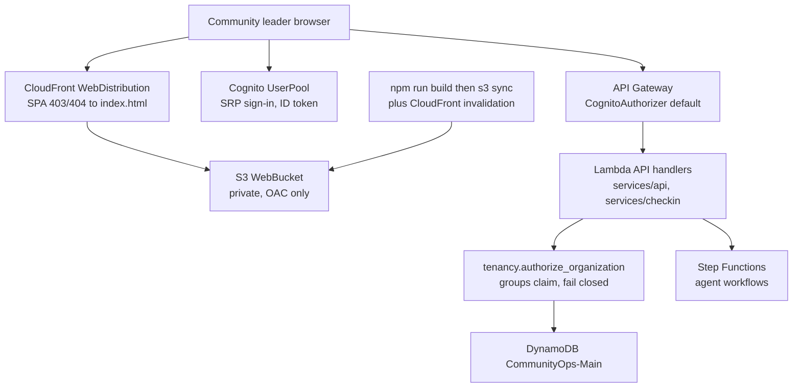
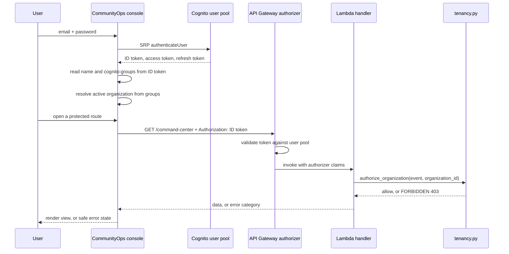
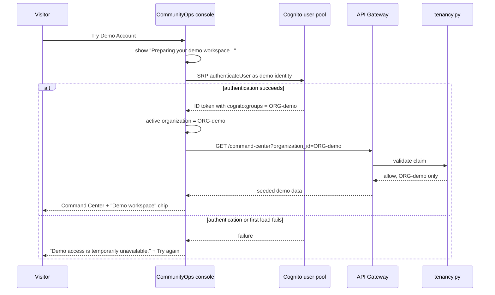
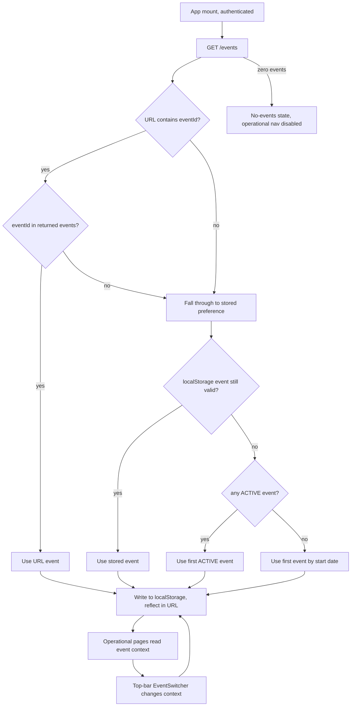
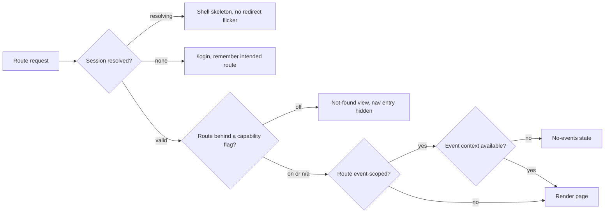
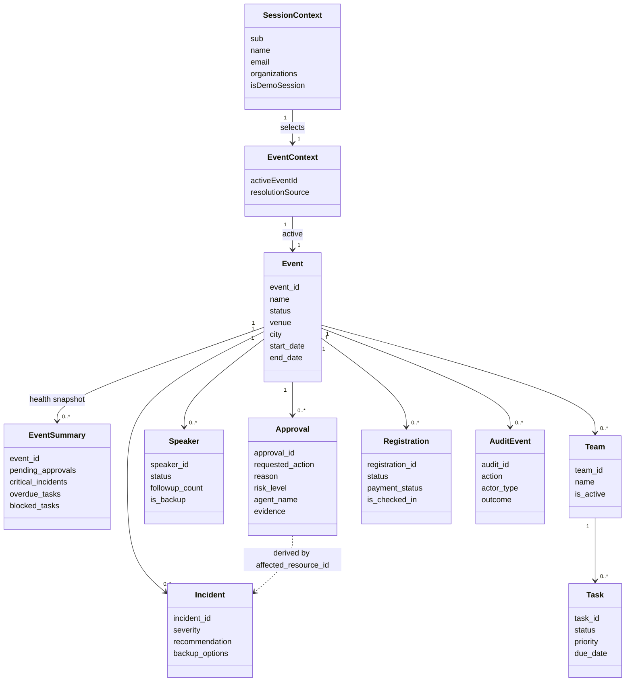

# CommunityOps Frontend — Design

## Overview

High-level design for the production frontend of CommunityOps. This is a
redesign and hardening pass over an existing, working React console that already
talks to a deployed AWS backend. The backend, data model, API contracts,
authorization model and infrastructure are treated as given. Nothing in this
document changes backend behaviour except where a gap is explicitly recorded in
§4 and §22.

**Scope**: UX, UI, interaction flows, frontend↔backend integration,
authentication experience, demo access, responsive behaviour, state handling,
accessibility, and visual system.

**Not in scope**: agent reasoning, Cedar evaluation, DynamoDB access patterns,
Step Functions orchestration, ticket generation. Those exist and work.

### Document map

Legacy cross-references in the numbered sections resolve as follows.

| Reference | Section |
|---|---|
| §1 | Positioning and UX contract (below) |
| §2, §3, §4 | Discovery report, Source priority, Ambiguities and contradictions |
| §19 | Interaction Loop and Notification Architecture |
| §21 | Testing Strategy |
| §22 | Backend and Infrastructure Prerequisites |

---

### 1. Positioning and UX contract

**Product name**: CommunityOps. Used everywhere user-facing — wordmark, page
title, document metadata, copy, error messages. No other product name appears in
the UI.

**Positioning**: An AI Community Operations Agent that handles the repetitive
coordination work behind community events while keeping consequential decisions
with the community leader.

**Emotional promise**: "I don't need to chase everyone. CommunityOps is watching
the operation. I only need to handle what actually needs me."

**Core principle**: Autonomous execution for repetitive work. Human control for
consequential decisions.

### 1.1 The three operational states

Every piece of operational information in the product resolves to exactly one of
three states. These are the spine of the visual language.

| State | Meaning | Visual treatment | Never |
|---|---|---|---|
| **Handled** | CommunityOps completed this, or it is progressing normally | Calm neutral-positive text + dot, no fill emphasis | Celebratory, green-badge spam |
| **Needs your decision** | A human decision is required before anything else happens | Restrained amber, left rule on the surface, explicit action buttons | Red / alarm styling |
| **Cannot be automated** | Work exists but no automated path resolves it — a person must act outside the product | Neutral with explicit explanation of what is blocked and why | Silent, or dressed as "pending" |

Colour never carries the meaning alone. Every state instance carries a text
label, and status dots/icons are supplementary.

### 1.2 Tone

70% professional, 20% community warmth, 10% restrained playfulness. Hindi-flavoured
micro-copy is used in a small, fixed set of places and nowhere else:

| Location | Copy |
|---|---|
| Command Center empty state | "Abhi koi drama nahi." + "CommunityOps is keeping things moving." |
| Check-In recovery entry | "Ticket nahi mila? Koi scene nahi." |
| Decision framing (Approvals, Command Center decision surface) | "Faisla aapka." |
| Check-In completion | "Scene handled." |

These four are the whole allowance. Everything else is plain professional
English. Error messages, verification results, audit entries and security copy
are never playful.

---

## 2. Discovery report

Everything in this section was read directly from the repository. Where I could
not verify something, it says so.

### 2.1 Current frontend architecture

| Aspect | Current state |
|---|---|
| Location | `apps/web` |
| Stack | React 19, TypeScript 5.7 strict, Vite 6, react-router-dom 7, Vitest 2 |
| Dependencies | `react`, `react-dom`, `react-router-dom`, `amazon-cognito-identity-js@6.3.15`. No UI kit, no CSS framework, no charting library, no animation library. |
| Entry | `src/main.tsx` → `BrowserRouter` → `App` |
| Shell | `src/App.tsx` — fixed 240px sidebar, 7 nav links, inline session gate, hardcoded `EVENT_ID = "EVT-devcon-2026"` |
| Pages | `src/pages/` — `CommandCenter`, `CheckinConsole`, `ApprovalCenter`, `SpeakerOps`, `TaskBoard`, `IncidentCenter`, `AuditLog`, `Login` |
| API layer | `src/api.ts` — single typed client, one `apiFetch` helper, `ApiError` with `status` + `category`, opt-in mock via `VITE_USE_MOCK` |
| Types | `src/types.ts` — hand-maintained interfaces mirroring the Python models |
| Auth | `src/auth.ts` — Cognito SRP sign-in, ID token retrieval with refresh, `cognito:groups` parsing, sign-out |
| Styling | `src/index.css` — one stylesheet, CSS custom properties, **dark theme** |
| Tests | `src/api.test.ts` — 10 tests covering mock gating, auth handling, error surfacing. No component tests. |
| Live check | `scripts/live-smoke.mjs` — signs in via SRP against the deployed pool and asserts every console view receives real data |
| TS config | `strict`, `noUnusedLocals`, `noUnusedParameters`, `noUncheckedIndexedAccess`, `@/*` path alias |

**Assessment**: the foundation is sound and should be kept. The API layer,
auth module, error contract and mock-gating discipline are production-quality and
are extended rather than replaced. What changes is the visual system (dark →
light), the shell, the information architecture, and every page's information
design.

**Two things in the existing code are already wrong against the real API**:

1. `ApprovalCenter` splits results into pending and resolved. The real
   `GET /events/{eventId}/approvals` returns **only** `APPROVAL#PENDING` items,
   so the resolved table is permanently empty against a live backend.
2. `TaskBoard` hardcodes a six-team list because no teams endpoint exists, then
   fans out one request per hardcoded team ID.

### 2.2 Existing reusable components

There are **no extracted components**. Reuse today happens through CSS classes
in `index.css`:

`.app-layout`, `.sidebar`, `.sidebar-logo`, `.sidebar-nav`, `.sidebar-account`,
`.main-content`, `.mock-mode-badge`, `.card`, `.card-header`, `.card-title`,
`.stats-grid`, `.stat-card`, `.stat-value`, `.stat-label`, `.badge` (+6 variants),
`.btn` (+4 variants, `.btn-sm`), `.input`, `.input-group`, table styles,
`.timeline` (+3 element classes), `.check-list`/`.check-item`/`.check-icon`,
`.stepper`/`.step`, `.page-title`, `.page-subtitle`, login block classes.

Every page also carries inline `style={{...}}` objects with literal colours,
paddings and font sizes. That is the root cause of the "eight templates" problem
and is the first thing the design system has to eliminate.

Worth keeping from the current CSS: the `prefers-reduced-motion` block and the
explicit `:focus-visible` rule. Both survive into the new system.

### 2.3 Verified backend API surface

Read from `template.yaml` (routes), `services/api/*.py` and
`services/checkin/handlers.py` (behaviour). Every route sits behind the API
Gateway Cognito user-pool authorizer. `organization_id` is required on every
call and is validated server-side against the caller's `cognito:groups`.

| Method | Path | Response shape (top level) | Notes |
|---|---|---|---|
| GET | `/command-center` | `organization_id`, `summary`, `events[]`, `recent_actions[]` | `summary`: `active_events`, `total_events`, `pending_approvals`, `critical_incidents`, `overdue_tasks`. `events[]` contains **ACTIVE and PUBLISHED events only**. `recent_actions[]` is **org-wide**, max 10, newest first. |
| GET | `/events` | `events[]`, `count` | All statuses. Filtered to `entity_type == EVENT`. Limit 50. |
| POST | `/events` | `event_id`, `message` | 201. Creates as `DRAFT`. |
| GET | `/events/{eventId}` | the event object **unwrapped** | Inconsistent with the list endpoints, which wrap. |
| PUT | `/events/{eventId}` | `event_id`, `message` | Allowed fields: name, description, status, venue, city, start_date, end_date, timezone, expected_attendees, registration_open, tags |
| GET | `/events/{eventId}/speakers` | `speakers[]`, `count` | Limit 100 |
| POST | `/events/{eventId}/speakers` | `speaker_id`, `message` | 201 |
| PUT | `/events/{eventId}/speakers/{speakerId}` | `speaker_id`, `message` | Allowed fields include status, topic, session_type, travel/accommodation flags and details, special_requirements, availability_notes, slides_submitted, av_requirements, is_backup, backup_for_speaker_id |
| GET | `/events/{eventId}/teams/{teamId}/tasks` | `tasks[]`, `count` | **Requires a known teamId.** Limit 200 |
| POST | `/events/{eventId}/teams/{teamId}/tasks` | `task_id`, `message` | 201 |
| PUT | `/events/{eventId}/teams/{teamId}/tasks/{taskId}` | `task_id`, `message` | Allowed fields include status, priority, assigned_to, due_date, depends_on, blocks, escalation_level, notes |
| GET | `/events/{eventId}/approvals` | `approvals[]`, `count` | **PENDING only.** No history endpoint. |
| PUT | `/events/{eventId}/approvals/{approvalId}` | `approval_id`, `status`, `message` | Body: `organization_id`, `decision` ∈ {APPROVED, DECLINED, EDITED}, `notes`, and `edited_action` (single free-text string) when EDITED. Returns 404 if absent, **409 if already decided**. |
| GET | `/events/{eventId}/incidents` | `incidents[]`, `count` | Limit 50 |
| POST | `/events/{eventId}/incidents` | `incident_id`, `message` | 201 |
| PUT | `/events/{eventId}/incidents/{incidentId}` | `incident_id`, `message` | Allowed fields include status, severity, impact_analysis, dependencies, backup_options, recommendation, evidence, resolution_summary. **`approval_id` is not an allowed field.** |
| GET | `/events/{eventId}/audit` | `audit_events[]`, `count` | `limit` query param, default 50, capped 200. Sorted newest first. |
| POST | `/events/{eventId}/checkin/search` | `found`, `count`, `registrations[]`, `requires_disambiguation`, `message?` | Body accepts one of `registration_id`, `email`, `phone`, `name` (priority in that order). Multi-match returns **masked** candidates with only `registration_id`, `attendee_name`, masked email, `ticket_type`. Single match returns the **full** registration record. |
| POST | `/events/{eventId}/checkin/verify` | `registration_id`, `verification{all_passed, checks[]}`, `registration{attendee_name, ticket_type, status, payment_status}` | 7 named checks, each `PASS`/`FAIL`/`WARN` |
| POST | `/events/{eventId}/checkin/recover` | `ticket_id`, `registration_id`, `download_url`, `already_existed`, `message` | 201 when newly generated, 200 when pre-existing. Idempotent. |
| POST | `/events/{eventId}/checkin/reconcile` | `reconciled`, `registration_id?`, `registration{}?`, `message`, `recovery_case_created?` | Accepts `transaction_id` only. Never card data. |
| POST | `/events/{eventId}/checkin/complete` | `registration_id`, `status`, `checked_in_at`, `message`, `was_already_checked_in` | 201 when newly created, 200 when already checked in. Idempotent. |
| POST | `/events/{eventId}/checkin/verify-qr` | `valid`, `registration_id`, `attendee_name`, `ticket_status`, `message` | **Deployed but not wrapped in `api.ts`.** |

**Verification check names** (fixed, from `services/checkin/verification.py`):
`registration_exists`, `event_match`, `registration_status`, `payment_status`,
`not_cancelled`, `not_refunded`, `checkin_eligibility`. The last one returns
`WARN` when the attendee has already checked in — a warning, not a failure.

**Error contract** (`services/shared/api_response.py`): every failure returns
`{ error: <category>, message, request_id?, details? }` with a category-to-status
mapping. Categories: `VALIDATION_ERROR` 400, `NOT_FOUND` 404,
`AMBIGUOUS_MATCH` 409, `UNAUTHORIZED` 401, `FORBIDDEN` 403,
`EXTERNAL_SERVICE_ERROR` 502, `TIMEOUT` 504, `CONFLICT` 409, `DUPLICATE` 409,
`POLICY_REQUIRES_APPROVAL` 202, `INTERNAL_ERROR` 500. Messages are already
written to be user-safe. `api.ts` already maps `error` → `ApiError.category`.

**Endpoints that do not exist**: team list, attendee/AttendeeOps anything,
registration list, approval history, incident→approval link, Slack anything,
agent chat, notification feed.

### 2.4 Existing Cognito configuration

From `template.yaml`:

| Setting | Value |
|---|---|
| User pool | `CommunityOps-UserPool-${Stage}` |
| Username attribute | `email` |
| Auto-verified | `email` |
| Password policy | min 8, requires lowercase, uppercase, numbers; symbols not required |
| Required schema attributes | `email`, `name` (both mutable, both required) |
| App client | `CommunityOps-WebClient-${Stage}` |
| Explicit auth flows | `ALLOW_USER_SRP_AUTH`, `ALLOW_REFRESH_TOKEN_AUTH` |
| Client secret | not generated (SPA-safe) |
| `PreventUserExistenceErrors` | `ENABLED` |
| Supported identity providers | `COGNITO` only |
| Hosted UI domain | **not configured** |
| OAuth flows / scopes / callback URLs | **not configured** |
| Federated identity providers | **none** |
| API authorizer | `AWS::Serverless::Api` default `CognitoAuthorizer` on `UserPool.Arn` |
| Org membership | Cognito **groups**, group name = organization ID, parsed and enforced in `services/shared/tenancy.py`, fail-closed |

Consequences for the frontend:

- Email + password sign-in over SRP works today and must be preserved.
- **Social sign-in is not possible without infrastructure changes.** There is no
  hosted UI domain, no OAuth configuration, no identity provider resource.
- There is no role claim anywhere. `services/shared/policy.py` accepts a
  `principal_role`, but no API handler ever reads one from the token. A UI that
  prints "Community Lead" would be inventing it.
- The `name` attribute is a required pool attribute, so the ID token carries a
  `name` claim. A real display name is available.

### 2.5 Existing demo configuration

Two distinct things currently share the word "demo":

1. **`VITE_USE_MOCK=true`** — a frontend-only mock layer inside `api.ts`. Opt-in
   only, never a fallback, guarded by 10 tests, and surfaced as a "⚡ Demo Mode"
   badge. This is a **local development** tool.
2. **`scripts/seed-demo.py`** — seeds realistic synthetic data into the real
   DynamoDB table: 1 organization, 1 active event, 10 registrations (with
   cancelled / waitlisted / pending-payment / duplicate-name / already-checked-in
   variants), 5 payment references (one orphan), 1 check-in, 6 speakers
   (1 backup, 1 cancelled), 6 teams, 9 tasks (overdue / blocked / in-progress /
   completed), 1 critical incident with a recommendation, 2 pending approvals.
   No lorem ipsum. Good scenario coverage already.

`scripts/seed-tenant-b.py` seeds a second organization (`ORG-tenant-b`) used to
prove cross-tenant isolation through the deployed API.

**What does not exist**: any demo *user*. There is no Cognito demo identity, no
demo group, no demo organization, no demo sign-in endpoint. `seed-demo.py` seeds
into `ORG-wemakedev`, which is also the organization in `apps/web/.env.example`
— so today demo data and "real" data occupy the same tenant.

### 2.6 Validation gates (exact commands)

From `apps/web/package.json` and `.github/workflows/ci.yml`, run from `apps/web`:

| Gate | Command | CI job |
|---|---|---|
| Type check | `npm run typecheck` | `frontend-check` |
| Lint | `npm run lint` | `frontend-check` |
| Test | `npm test -- --run` | `frontend-check` |
| Build | `npm run build` (`tsc -b && vite build`) | not in CI today |
| Live integration | `node scripts/live-smoke.mjs` | manual, needs deployed stack |

CI also runs Ruff, MyPy (non-blocking), pytest, `sam validate --lint`, and a
TruffleHog secret scan across the repo. The secret scan is why no credential of
any kind may be committed for the demo path.

`npm run build` is **not** currently a CI gate. Adding it is a recommended
frontend-only change, because `tsc -b` uses a different project graph than
`tsc --noEmit` and can fail independently.

**Test environment gap**: `vitest` is configured with no `environment`, so tests
run in Node. `jsdom` and `@testing-library/react` are not installed. Component
and interaction tests require adding them (§21).

---

## 3. Source priority

Applied throughout this document, highest first:

1. Working backend / API / infrastructure implementation
2. Kiro steering files and current repository specs
3. Existing frontend contracts and types
4. Current frontend implementation
5. Command Center visual reference
6. Prototype navigation / IA reference
7. Background product reference material

Repository implementation always wins. No backend behaviour is changed to match
a document.

---

## 4. Ambiguities and contradictions

Nothing here is silently reconciled.

### A1 — Social sign-in buttons have no infrastructure behind them

- **Ambiguity**: The design calls for "Continue with Google / Amazon / Apple" on the login screen.
- **Source**: Design brief vs `template.yaml` — `SupportedIdentityProviders: [COGNITO]`, no `UserPoolDomain`, no OAuth flows, scopes or callback URLs, no `AWS::Cognito::UserPoolIdentityProvider`.
- **Recommended implementation**: Render provider buttons only from a config-driven allowlist (`VITE_AUTH_PROVIDERS`, empty by default). With no providers configured, the block and its "or" divider do not render at all — email/password becomes the whole form and stays visually complete. Never render a disabled or decorative provider button. When a provider *is* configured, the button starts the Cognito hosted-UI authorization-code redirect. Provider client secrets live in Secrets Manager and are referenced by the template; nothing provider-side enters the bundle.
- **Impact**: Frontend (config-driven rendering, redirect callback route). Infrastructure (hosted UI domain, OAuth flows/scopes, callback + logout URLs, one identity provider resource per provider, secret references). Apple additionally needs key material and a services ID. Documentation (`.env.example`, README).

### A2 — "Community Lead" role is not in any token or API

- **Ambiguity**: Sidebar should show the user's role.
- **Source**: Design brief vs `template.yaml` pool schema (`email`, `name` only) and `services/shared/tenancy.py` (groups carry organization IDs, not roles). `policy.py` has role logic that no handler feeds.
- **Recommended implementation**: Show `name` (real, from the ID token), email, and the active organization. Do **not** print a role. If a role label is genuinely wanted, it needs a backend-owned source — a `custom:role` attribute surfaced as a claim, or a role-group naming convention — specified before any UI depends on it.
- **Impact**: Frontend (show what exists). Backend/infrastructure only if a role label is later required.

### A3 — Approvals endpoint returns pending only

- **Ambiguity**: "Decision queue" implies recently-decided items are visible; the current page renders a resolved table.
- **Source**: `services/api/approvals_handler.py` queries `GSI1` with `sk_begins_with="APPROVAL#PENDING"`.
- **Recommended implementation**: Approvals is a pure pending queue. Decision outcomes are shown two ways that use real data: an optimistic, session-scoped "Recently decided" strip built from decisions made in the current session, and the Audit Log, which does record `APPROVAL_APPROVED` / `APPROVAL_DECLINED` / `APPROVAL_EDITED`. Remove the permanently-empty resolved table. A durable history view needs a status filter on the endpoint.
- **Impact**: Frontend now. Backend if durable history is wanted later.

### A4 — Granular approval editing is not supported by the contract

- **Ambiguity**: The brief describes an edit surface with editable fields (original action → editable fields → updated action → confirm).
- **Source**: `approvals_handler._decide_approval` accepts `decision="EDITED"` plus a single free-text `edited_action` string. `Approval.edited_action` in `models/approval.py` is also a plain string. There is no field-level schema for a requested action.
- **Recommended implementation**: Ship Edit at the real fidelity — a labelled multi-line field, pre-filled with the agent's `requested_action`, with the original shown immediately above it for comparison, submitted as `decision="EDITED"` with `edited_action`. Copy says "Adjust the action CommunityOps will take". No fake per-field form. Field-level editing requires a structured action schema on the backend first.
- **Impact**: Frontend. Backend if structured editing is wanted later.

### A5 — TeamOps needs a team list that no endpoint provides

- **Ambiguity**: TeamOps must be team-first, but tasks are only reachable per team ID.
- **Source**: `template.yaml` exposes `/events/{eventId}/teams/{teamId}/tasks` and nothing else under `teams`. `TaskBoard.tsx` hardcodes six team IDs. `seed-demo.py` writes real `TEAM` entities at `EVENT#{eventId}#TEAM#{teamId}`.
- **Recommended implementation**: Add `GET /events/{eventId}/teams` returning `{teams[], count}`. The data already exists; the handler must filter `entity_type == "TEAM"`, because the `EVENT#{eventId}#TEAM#` sort-key prefix also matches task items. Until it exists, TeamOps renders a "Team directory unavailable" state naming the missing contract. **Do not ship the hardcoded list** — it fabricates the org's team structure.
- **Impact**: Backend (one read handler) + infrastructure (one route). Frontend depends on it.

### A6 — AttendeeOps has a model but no API and no data

- **Ambiguity**: An AttendeeOps readiness funnel is requested.
- **Source**: `services/shared/models/attendee.py` defines `Attendee` with `dietary_requirements`, `accommodation_required`, `accessibility_requirements`, `arrival_confirmed`, `missing_fields`, `info_request_sent`, etc. There is **no** attendee handler, **no** route, and `seed-demo.py` writes no `ATTENDEE` entities.
- **Recommended implementation**: Do not build AttendeeOps against invented data, and do not fake the funnel from `Registration` — registration carries only `status`, `payment_status` and `is_checked_in`, which gives at most two of the four funnel stages and none of the exception categories. Specify the contract now (`GET /events/{eventId}/attendees` → attendee records including `missing_fields`), put the page behind a capability flag, and hide the nav entry entirely when the flag is off. A hidden nav item is honest; a half-funnel is not.
- **Impact**: Backend (handler + seed data) + infrastructure (route). Frontend is built last and only against the real contract.

### A7 — Slack does not exist anywhere in the repository

- **Ambiguity**: Slack is described as the notification and attention layer, with a "● Slack connected" indicator.
- **Source**: A repository-wide search for `slack` returns nothing. No connector, no SNS/SES-to-Slack path, no webhook configuration, no EventBridge rule targeting Slack.
- **Recommended implementation**: Render no Slack indicator. A "Slack connected" chip with no integration behind it is a false claim about system state, which is exactly what the mock-mode discipline in `api.ts` exists to prevent. The interaction loop is documented in §19 as the intended architecture. If Slack is later integrated, the indicator becomes a single config-driven status chip in the top bar — never an in-app notification centre, never a mirror of Slack messages.
- **Impact**: Documentation now. Backend + infrastructure if Slack is genuinely wanted.

### A8 — Step Functions task tokens are returned to the browser

- **Ambiguity**: Not a design conflict — a security finding that constrains the frontend.
- **Source**: `services/workflows/speaker_followup.py` (`_await_approval`) and `services/workflows/incident_response.py` write `task_token` onto the `APPROVAL` item. `approvals_handler._list_approvals` returns raw DynamoDB items, so `task_token` would be serialized into the approvals response.
- **Recommended implementation**: Backend must project or strip `task_token` (and `workflow_execution_id`) out of the approvals response. Frontend must never read, render, log or persist any field it does not explicitly model — the typed `Approval` interface acts as the allowlist, and no raw-record rendering is permitted anywhere (see also A11).
- **Impact**: Backend (required, security). Frontend (typed-field discipline, no raw rendering).

### A9 — Approving does not resume the workflow

- **Ambiguity**: Post-decision copy "CommunityOps will continue from here" implies execution resumes.
- **Source**: Task tokens are stored, but `_decide_approval` only writes status and audit — it never calls `SendTaskSuccess` / `SendTaskFailure`. README also states the state machines have not been executed end to end.
- **Recommended implementation**: Post-decision copy states only what is true: "Decision recorded." plus the concrete outcome ("CommunityOps will not send this follow-up." / "CommunityOps will proceed with this action."). Reserve the continuation phrasing until the callback is wired.
- **Impact**: Frontend (copy). Backend if continuation is wanted.

### A10 — Monetary and budget figures are not in the data

- **Ambiguity**: The reference decision surface shows "₹12,500 estimated commitment".
- **Source**: `Approval.evidence` is a free-form dict. The seeded approvals contain `{incident_id, backup_speaker}` and `{speaker_id, followup_count}`. No amount. `PaymentReference` has an `amount`, but it is per-transaction and unrelated to approvals.
- **Recommended implementation**: The decision surface renders a financial line **only** when `evidence` contains a recognised amount field. Absent that, the consequence line describes the non-financial commitment in words. Never synthesize or estimate a figure.
- **Impact**: Frontend (conditional rendering). Backend if approvals should carry cost estimates.

### A11 — Evidence and audit details are unstructured and may contain PII

- **Ambiguity**: How much of `evidence` / `details` to show.
- **Source**: `ApprovalCenter.tsx` currently renders `JSON.stringify(evidence)` in a `<pre>`. `checkin/handlers.py::_create_recovery_case` writes `search_criteria` — which can hold an email or phone — into audit `details`.
- **Recommended implementation**: Never render raw JSON in the product. Evidence is displayed as a known-key allowlist rendered as labelled rows, with unrecognised keys counted rather than dumped ("3 further data points recorded"). Audit entries render only modelled fields; `details` is not rendered.
- **Impact**: Frontend.

### A12 — Command Center recent actions are org-wide, not event-scoped

- **Ambiguity**: "What is CommunityOps handling?" for the selected event.
- **Source**: `command_center_handler` reads audit with `query_by_pk(org_id, "AUDIT#", limit=20)` and returns the newest 10 across all events.
- **Recommended implementation**: The Command Center handled strip is built from `GET /events/{eventId}/audit` for the selected event (agent-actor entries only). `recent_actions` from `/command-center` is used for the org-level activity line and is labelled as organization-wide so the scope is never ambiguous.
- **Impact**: Frontend.

### A13 — Command Center hides non-active events

- **Ambiguity**: "How many events is CommunityOps watching?"
- **Source**: `command_center_handler` puts only `ACTIVE`/`PUBLISHED` events in `events[]`, while `summary.total_events` counts every event including drafts and completed ones.
- **Recommended implementation**: The orbit visual and per-event health render `events[]` (watched events). Any headline count uses `summary.active_events`, never `total_events`. If a total is shown, it is labelled "of N total".
- **Impact**: Frontend.

### A14 — Stack name differs between config and script

- **Ambiguity**: Which CloudFormation stack to read frontend config from.
- **Source**: `samconfig.toml` → `stack_name = "CommunityOps"`; `scripts/deploy.sh` → `communityops-${STAGE}`; README → `--stack-name CommunityOps`.
- **Recommended implementation**: Out of frontend scope to fix, but it affects how config is obtained. Frontend documentation must state which stack name applies to the deployment actually in use rather than assuming one.
- **Impact**: Documentation. Backend/infrastructure owners should reconcile.

### A15 — The console has no deployment path

- **Ambiguity**: Hosting exists in the template but nothing publishes to it.
- **Source**: `template.yaml` defines `WebBucket`, `WebOriginAccessControl`, `WebDistribution` (with SPA 403/404 → `/index.html`), `WebBucketPolicy`, and a `ConsoleUrl` output. `scripts/deploy.sh` never builds or uploads the console.
- **Recommended implementation**: Add a console publish step — build, `s3 sync` to `WebBucketName`, CloudFront invalidation — either appended to `deploy.sh` or as a separate script. The CloudFront SPA error mapping already supports client-side routing, so `BrowserRouter` needs no change.
- **Impact**: Infrastructure / operations tooling.

### A16 — Event context is hardcoded

- **Ambiguity**: Which event the operational pages describe.
- **Source**: `App.tsx` line 15 — `const EVENT_ID = "EVT-devcon-2026"`, passed to six pages.
- **Recommended implementation**: Replace with real event context from `GET /events`, defaulting to the first `ACTIVE` event, persisted per user in `localStorage`, exposed through the top-bar switcher, and reflected in the URL so a view is shareable and reloadable.
- **Impact**: Frontend.

### A17 — CORS is fully permissive

- **Ambiguity**: None; a hardening note.
- **Source**: `template.yaml` API `Cors.AllowOrigin: "'*'"`; `api_response.CORS_HEADERS` also sets `*`.
- **Recommended implementation**: Restrict to the CloudFront distribution domain for production. Does not block frontend work.
- **Impact**: Infrastructure.

### A18 — There is no demo account, and demo data is not isolated from real data

- **Ambiguity**: "Try Demo Account" is a headline product requirement — a visitor
  must reach a populated Command Center without being handed a real operator's
  credentials. Nothing in the repository provides any part of this.
- **Source** (all verified by reading the files):
  - `template.yaml` → the Cognito block defines exactly two resources, `UserPool`
    and `UserPoolClient`. There is **no** `AWS::Cognito::UserPoolGroup`, no
    `AdminCreateUser` custom resource, no pre-sign-up / pre-token-generation
    trigger, no demo identity of any kind. Auth flows are `ALLOW_USER_SRP_AUTH`
    and `ALLOW_REFRESH_TOKEN_AUTH` only; no client secret; outputs expose only
    `UserPoolId` and `UserPoolClientId`.
  - Organization groups — the entire tenancy mechanism — are **not created by
    infrastructure at all**. `README.md` creates them by CLI
    (`cognito-idp create-group`, `admin-add-user-to-group` for `ORG-wemakedev`).
    Group membership is an operational step today, not a deployed resource.
  - `services/shared/tenancy.py` derives access solely from `cognito:groups`,
    fails closed, and has no notion of demo, guest, read-only or role. A demo
    identity is authorized by exactly the same rule as any other user — which is
    what makes a group-scoped demo org safe, and what makes anything else unsafe.
  - `scripts/seed-demo.py` hardcodes `ORG_ID = "ORG-wemakedev"` and
    `EVENT_ID = "EVT-devcon-2026"` — the same organization as
    `apps/web/.env.example`. **Demo data and real data currently share a tenant.**
  - `scripts/seed-tenant-b.py` seeds `ORG-tenant-b`, proving the
    second-organization pattern already works against the deployed API.
  - `apps/web/src/api.ts` sends `organization_id` from build-time `VITE_ORG_ID`;
    `apps/web/src/auth.ts` already exposes `getMemberOrganizations()`, parsed from
    the token's groups claim.
  - `VITE_USE_MOCK` is a frontend-only mock layer, not authentication. Wiring
    "Try Demo Account" to it would present fabricated state as live operation —
    precisely what the mock gating in `api.ts` exists to prevent.
  - `.github/workflows/ci.yml` runs a TruffleHog secret scan over the repository,
    so no demo password may ever be committed.
- **Recommended implementation**: a real Cognito SRP sign-in as a preconfigured
  demo identity scoped to a dedicated demo organization. No new auth path, no
  client-side session forgery, no bypass of API Gateway or `tenancy.py`.
  1. **Demo tenant**: new organization `ORG-demo` with a matching Cognito group
     named `ORG-demo` (group name = organization ID, as `tenancy.py` requires).
  2. **Demo identity**: `demo@communityops.dev`, `name = "Demo Lead"`, member of
     `ORG-demo` **and no other group**, password set permanent so no forced-reset
     challenge interrupts the flow. Created by a script
     (`scripts/create-demo-user.py`), **not** by committed configuration, because
     it requires a password and CI scans for secrets. The script reads the
     password from a file or parameter, matching the precedent already set by
     `scripts/live-e2e-test.py` and `SMOKE_PASSWORD_FILE` in `live-smoke.mjs`.
  3. **Demo data**: parameterize `seed-demo.py` with `--organization-id` and
     `--event-id` (defaults unchanged) and seed `ORG-demo` with its own event and
     synthetic records. `ORG-wemakedev` is then no longer the demo tenant.
  4. **Frontend action**: the button runs the same SRP `authenticateUser` call as
     the login form, with credentials injected through build/runtime config
     (`VITE_DEMO_USERNAME`, `VITE_DEMO_PASSWORD`). The button renders only when
     both values are present; it is absent, not disabled, otherwise.
  5. **Organization resolution**: the active organization must come from the
     token's groups via `getMemberOrganizations()` rather than a fixed
     `VITE_ORG_ID`, so the demo identity lands in `ORG-demo` automatically. The
     backend still validates every call; the UI-supplied value is never trusted.
  6. **Honesty in the UI**: a persistent top-bar "Demo workspace" chip, visually
     and semantically distinct from the `VITE_USE_MOCK` "Demo Mode" badge, which
     remains a local-development-only signal.
- **Stated plainly — the credential is public**: anything delivered to a browser
  bundle is readable by anyone. This is acceptable *only* because the identity is
  a member of one group whose entire reachable dataset is synthetic. The demo
  organization must contain no real personal data, the password must be
  rotatable and used nowhere else, the demo org should be re-seeded periodically
  to reset visitor mutations, and Cognito throttling plus a WAF rate rule on the
  console origin should contain abuse. **Hardened alternative if a public
  credential is unacceptable**: a backend `POST /demo-session` endpoint that
  keeps the credential in Secrets Manager, performs `ADMIN_USER_PASSWORD_AUTH`
  server-side and returns tokens. That removes the credential from the bundle at
  the cost of one Lambda, one route, one secret and a new auth flow on the client.
  Recorded as the preferred end state; not a blocker for the demo path above.
- **Impact**:
  - *Backend / infrastructure (prerequisite)*: `AWS::Cognito::UserPoolGroup` for
    `ORG-demo` in `template.yaml` (and, for consistency, for the real orgs that
    are currently CLI-created); `scripts/create-demo-user.py`; `seed-demo.py`
    parameterization; optional WAF rate rule; optional `POST /demo-session`.
  - *Frontend*: the Try Demo Account action, the "Preparing your demo
    workspace…" transition, the failure path, the "Demo workspace" chip, and the
    switch from `VITE_ORG_ID` to token-derived organization context.
  - *Documentation*: `apps/web/.env.example` and README entries for
    `VITE_DEMO_USERNAME` / `VITE_DEMO_PASSWORD` with placeholder values only.
  - *Blocked until the group, user and seeded org exist*: the button does not
    render, and no demo affordance is faked.

---

## Architecture

### 5.1 Deployment topology

The frontend is a static single-page application. Every resource in this diagram
already exists in `template.yaml` except the publish step (A15).

Decisions:

| Decision | Rationale |
|---|---|
| Keep Vite + React 19 + `react-router-dom` 7 | Already working, strict TS, no migration value in changing it |
| Extend `src/api.ts` rather than replace it | It already owns the error contract, mock gating and auth header; a data-fetching library would duplicate that surface |
| No UI kit, no CSS framework | The design system is a token file plus ~15 components; a kit would fight the visual language and add bundle weight |
| `BrowserRouter` retained | CloudFront already maps 403/404 to `/index.html` |
| Static hosting, no SSR | No SEO or first-paint requirement; the app is authenticated-only |

### 5.2 Authentication flow

Authorization is server-side only. The frontend decides what to *render*; it
never decides what a user may *access*.

| Rule | Consequence in the UI |
|---|---|
| Token refresh is handled inside `auth.ts` | Pages never manage token lifetime |
| A 401 means the session is gone | Redirect to login, preserve intended route, no error toast |
| A 403 means the org claim does not cover the request | Render "You don't have access to this organization's data." — never retry, never switch org silently |
| No role claim exists (A2) | No role label anywhere; `name`, email and active organization only |

### 5.3 Demo account flow

The demo path differs from normal sign-in in exactly one way: who supplies the
credentials. Everything downstream — token, authorizer, tenancy check, data
scope — is identical. A demo session can never read another organization because
`tenancy.py` rejects any `organization_id` outside the token's groups.

### 5.4 Event context resolution (A16)

`localStorage` is keyed per Cognito `sub` so a demo session and a real session on
the same browser never inherit each other's event selection. The hardcoded
`EVENT_ID` in `App.tsx` is deleted.

### 5.5 Routing map and protected-route model

| Route | View | Access | Event-scoped |
|---|---|---|---|
| `/login` | Login + Try Demo Account | public, redirects away when a session exists | no |
| `/` | Command Center | protected | org-level, watched events |
| `/speakers` | SpeakerOps | protected | yes |
| `/teams` | TeamOps | protected | yes |
| `/attendees` | AttendeeOps | protected + capability flag (A6) | yes |
| `/incidents` | IncidentOps | protected | yes |
| `/checkin` | Check-In | protected | yes |
| `/approvals` | Approvals | protected | yes |
| `/audit` | Audit Log | protected | yes |
| `*` | Not-found view inside the shell | protected | no |

The session gate currently inlined in `App.tsx` becomes a single
`RequireSession` route wrapper. Protected routes never render page content while
the session is unresolved, and never flash the login screen on reload.

---

## Design System and Visual Language

This is the source of truth for every visual value in the product.

### 6.1 Theme decision

**Light theme only.** The existing `src/index.css` is dark and is converted, not
themed. There is no dark-mode toggle: two themes double the review surface, and
the discovery already identified visual inconsistency as the primary defect.
`prefers-reduced-motion` and the explicit `:focus-visible` rule survive the
conversion unchanged.

### 6.2 Token set

All tokens live as CSS custom properties in one file (`src/styles/tokens.css`),
imported once. No component defines a raw colour, size, radius or shadow.

| Group | Tokens | Value intent |
|---|---|---|
| Surface | `--bg-page`, `--bg-surface`, `--bg-subtle`, `--bg-raised` | Warm off-white page, white surface, faint warm grey for inset areas |
| Brand | `--brand`, `--brand-strong`, `--brand-soft` | Deep community green/teal; `strong` for hover/active, `soft` for tints |
| Attention | `--attention`, `--attention-soft` | Restrained amber for "Needs your decision" |
| Risk | `--risk`, `--risk-soft` | Restrained red, reserved for CRITICAL severity and destructive confirmation |
| Text | `--text-primary`, `--text-secondary`, `--text-muted`, `--text-inverse` | Deep charcoal primary, never pure black |
| Line | `--border`, `--border-strong`, `--focus-ring` | Soft neutral borders; focus ring is brand-derived and always visible |
| Type scale | `--fs-display`, `--fs-page-title`, `--fs-section`, `--fs-card-title`, `--fs-body`, `--fs-support`, `--fs-meta`, `--fs-label` | Eight steps, nothing outside them |
| Type weight / height | `--fw-regular`, `--fw-medium`, `--fw-semibold`, `--lh-tight`, `--lh-body` | Weight carries hierarchy before size does |
| Spacing | `--sp-1`=4, `--sp-2`=8, `--sp-3`=12, `--sp-4`=16, `--sp-6`=24, `--sp-8`=32, `--sp-12`=48, `--sp-16`=64 | Only these values appear in layout |
| Radius | `--radius-sm`, `--radius-md`, `--radius-lg`, `--radius-pill` | Cards `md`, badges `pill` |
| Elevation | `--shadow-card`, `--shadow-raised`, `--shadow-drawer` | Three levels; borders do most of the separation work |
| Z-index | `--z-base`, `--z-sticky`, `--z-drawer`, `--z-overlay`, `--z-toast` | Named, never numeric literals |
| Breakpoints | `--bp-sm` 640, `--bp-md` 900, `--bp-lg` 1200, `--bp-xl` 1440 | Used through a fixed set of media queries |
| Controls | `--control-h` 40, `--control-h-sm` 32, `--input-h` 40, `--touch-min` 44 | One button height, one input height |
| Layout | `--content-max` 1280, `--page-pad-x`, `--page-pad-y`, `--header-h` 64, `--nav-w` 248, `--card-pad` 24, `--drawer-w` 480 | Every page uses the same frame |

### 6.3 Hard rules

| Rule | Reason |
|---|---|
| **Zero inline `style={{...}}` literals in page or component files** | Discovery found inline literals on every page; they are the root cause of the "eight templates" problem. Layout uses classes; genuinely dynamic values pass through CSS custom properties set on the element. |
| Tokens are the only source of design values | A hex code or pixel size in a component is a defect |
| One UI font for the entire product | A single display face may be used for hero statements only; no serif body text |
| Colour never carries meaning alone | Every state has a text label; dots and icons are supplementary |
| No decorative iconography for status | Icons repeat the label, they do not replace it |
| No chart library | The two visuals in the product are composed from tokens and real values |

### 6.4 State visual language

| State / condition | Label used in UI | Treatment |
|---|---|---|
| Handled | "Handled" / past-tense agent sentence | `--text-secondary` text, neutral dot, no fill |
| Needs your decision | "Needs your decision" | `--attention` left rule on the surface, `--attention-soft` tint, explicit action buttons |
| Cannot be automated | "Cannot be automated" | Neutral surface, `--border-strong`, one sentence naming what is blocked and why |
| Risk LOW / MEDIUM | "Low risk" / "Medium risk" | Neutral and `--attention` pill respectively |
| Risk HIGH / CRITICAL | "High risk" / "Critical risk" | `--attention-soft` and `--risk-soft` pill; `--risk` reserved for CRITICAL |
| Blocked (task) | "Blocked" | Neutral pill plus the blocking reason inline |
| Overdue (task) | "Overdue" | `--attention` pill plus relative age |
| Completed | "Completed" | `--text-muted` pill, lowest visual weight on the page |

`StatusBadge` owns this table. No page maps a status to a colour itself.

---

## Components and Interfaces

There are currently zero extracted components (§2.2). These are the components to
create; descriptions are responsibility and reuse contracts, not signatures.

| Component | Responsibility | Reuse contract |
|---|---|---|
| `AppShell` | Owns the page frame: nav, top bar, content column, max width, page padding, skip link, single `<main>` landmark | Every authenticated route renders inside it; pages never define their own frame |
| `Sidebar` | Grouped navigation, active-state indication, collapse behaviour, account block showing `name`, email and active organization | Nav items come from one config list; entries behind a capability flag are absent, not disabled (A6) |
| `Topbar` | Event switcher, "Demo workspace" chip when applicable, sign-out | Only place that renders global context |
| `EventSwitcher` | Presents watched events, changes event context, reflects the change in the URL and `localStorage` | Sole writer of event context |
| `StatusBadge` | Renders one operational state or domain status as label + supplementary dot | Only component permitted to map status to colour |
| `RiskIndicator` | Renders approval/incident risk level with severity-appropriate restraint | Used by Approvals, IncidentOps and the Command Center decision surface |
| `DecisionCard` | The decision surface: agent attribution, requested action, reason, consequence line, evidence rows, risk, actions | Identical on the Command Center and Approvals so a decision never looks like two different things |
| `ApprovalActions` | Approve / Edit / Decline with one confirmation pattern, in-flight locking, and 409 handling | The only place a decision is submitted |
| `Drawer` | Right-side progressive-disclosure panel: focus trap, Escape to close, focus return to trigger, scroll lock, `aria-modal` | Every "view details" interaction in the product uses it; no page builds a bespoke panel |
| `Timeline` | Chronological event list with actor attribution and relative time | Audit Log, incident history, approval context |
| `AgentStatus` | The compact "CommunityOps is handling…" strip built from agent-actor audit entries | Command Center and, in reduced form, operational pages |
| `EmptyState` | Calm empty messaging with optional single action | One empty pattern product-wide |
| `ErrorState` | Safe error copy + Try again | One error pattern product-wide; never renders an exception |
| `Skeleton` | Shape-preserving loading placeholders | One loading pattern product-wide; no spinners on full pages |
| `PageHeader` | Page title, context line, and at most one primary action | Guarantees identical vertical rhythm on all eight pages |
| `DataTable` | Semantic table with consistent alignment, empty and loading rows, and row-level drawer trigger | SpeakerOps, TeamOps, Audit Log, Check-In candidates |
| Page components | One per route, composing the above | A page contains layout and data wiring only — no visual primitives of its own |

### 7.1 Standardized behaviours

| Behaviour | Rule |
|---|---|
| Progressive disclosure | Always a right-side `Drawer`; opens and closes identically everywhere |
| Keyboard | Escape closes any drawer or confirmation; focus returns to the triggering element; focus is trapped while open |
| Confirmation | One pattern: inline confirmation inside the drawer or card, never a browser `confirm()`, never a second modal layer |
| Mutation feedback | Button enters a loading state, controls lock, result replaces the action row in place; no toast-only confirmation |
| Loading | `Skeleton` in the shape of the eventual content |
| Empty | `EmptyState`, calm, no illustration clutter |
| Error | `ErrorState` with "Try again" that re-runs only the failed request |
| Relative time | One formatter, used everywhere; absolute timestamp available in the drawer or as a title attribute |

### 7.2 Navigation information architecture

| Group | Entries |
|---|---|
| (ungrouped) | Command Center |
| OPERATIONS | SpeakerOps, TeamOps, AttendeeOps, IncidentOps |
| EVENT DAY | Check-In |
| GOVERNANCE | Approvals, Audit Log |

AttendeeOps is omitted from the nav entirely while its capability flag is off
(A6). Group labels use `--fs-label`, are not interactive, and do not collapse.

---

## Page Layouts

Every page: `PageHeader`, one primary information structure, at most one
contextual visual, progressive disclosure into a `Drawer`, and the three shared
loading/empty/error patterns. No page renders raw JSON (A11).

### 8.1 Command Center

| Aspect | Design |
|---|---|
| Primary question | "Is anything waiting on me right now?" |
| Hierarchy | 1. Greeting and context line: `name`, active organization, watched-event count from `summary.active_events` (A13). 2. **One** decision surface — the oldest pending approval across watched events, with Approve / Edit / Decline. 3. The orbit visual. 4. The compact "CommunityOps is handling…" strip. |
| Contextual visual | One orbit/constellation over `events[]` from `/command-center` — one node per watched event, node treatment driven by that event's real `pending_approvals`, `critical_incidents`, `overdue_tasks`, `blocked_tasks`. Selecting a node sets event context. Never renders draft or completed events (A13). |
| Progressive disclosure | "Why this action?" opens the drawer with the agent's reason, evidence rows and the affected resource. There is no prominent "CommunityOps recommends" card. |
| Not present | KPI wall, stat-card grid, chart panel, notification feed, Slack chip (A7) |
| Handled strip | Built from `GET /events/{eventId}/audit` filtered to agent actors for the selected event. The org-wide `recent_actions` feed appears below, explicitly labelled organization-wide (A12). |
| Empty | "Abhi koi drama nahi." + "CommunityOps is keeping things moving." plus the handled strip, so the page is calm but not blank |
| Loading | Skeleton of the same three blocks |
| Error | "CommunityOps couldn't load this view." + Try again |

Five-second test: greeting, then either one decision or one calm sentence. No
scrolling required to answer the primary question.

### 8.2 SpeakerOps

| Aspect | Design |
|---|---|
| Primary question | "Which speakers are not yet confirmed, and what is CommunityOps doing about it?" |
| Hierarchy | Status-grouped speaker list — Needs attention, In progress with CommunityOps, Confirmed, Declined/Cancelled — over `GET /events/{eventId}/speakers` |
| Contextual visual | One confirmation-progress bar segmented by real status counts. No pie chart, no sparkline. |
| Drawer | Topic, session type, `followup_count`, travel and accommodation flags, backup relationship, and the agent activity for that speaker from the audit log |
| Agent attribution | `FOLLOWUP_SENT` and `AWAITING_RESPONSE` read as Handled with the follow-up count stated, not as a user to-do |
| Empty / loading / error | "No speakers yet for this event." / list skeleton / shared error state |

### 8.3 TeamOps

| Aspect | Design |
|---|---|
| Primary question | "Which team is blocked, and on what?" |
| Blocking gap | `GET /events/{eventId}/teams` does not exist (A5). Until it ships, the page renders **"Team directory unavailable"**, naming the missing contract in plain language and stating that task data is reachable once a team directory exists. The hardcoded six-team list in `TaskBoard.tsx` is deleted, not preserved. |
| Hierarchy once the contract exists | Team cards showing blocked / overdue / in-progress / completed counts from `GET /events/{eventId}/teams/{teamId}/tasks`, ordered by attention needed |
| Contextual visual | Per-team completion bar with blocked and overdue portions distinguished by label and pattern, not colour alone |
| Drawer | Task list for the team; per-task title, assignee, due date, `depends_on` / `blocks` relationships expressed as sentences, escalation level |
| Empty / loading / error | "No tasks recorded for this team." / card skeletons / shared error state |

### 8.4 AttendeeOps

| Aspect | Design |
|---|---|
| Status | Behind a capability flag, off by default; nav entry hidden entirely (A6) |
| Why | No attendee endpoint, no route, no seeded `ATTENDEE` entities. `Registration` cannot produce the readiness funnel or its exception categories. |
| Design when the contract lands | Readiness funnel over real attendee records — Registered → Information complete → Requirements captured → Arrival confirmed — with exception lists driven by `missing_fields`, `dietary_requirements`, `accessibility_requirements`, `accommodation_required` |
| Interim behaviour | Route resolves to the not-found view; nothing partial is shipped |

### 8.5 IncidentOps

| Aspect | Design |
|---|---|
| Primary question | "What is at risk, and what does CommunityOps propose?" |
| Hierarchy | Severity-ordered incident list from `GET /events/{eventId}/incidents`, CRITICAL first, resolved incidents collapsed below |
| Contextual visual | Severity distribution strip over real counts |
| Drawer | Title, description, affected resource, impact analysis, dependencies, `backup_options` as a labelled list, `recommendation` presented as CommunityOps' proposal with its state, and resolution summary when resolved |
| Approval linkage | `approval_id` is **not** an allowed field on incidents, so no incident→approval link is rendered. Related pending approvals are surfaced only when an approval's `affected_resource_id` matches the incident, and the relationship is described as derived. |
| Empty / loading / error | "No incidents for this event." / list skeleton / shared error state |

### 8.6 Check-In

| Aspect | Design |
|---|---|
| Primary question | "Can this person go in?" |
| Flow | Search → resolve/disambiguate → verify → complete, with recovery and reconciliation as branches. Single-column, large controls, optimised for a phone at a venue desk. |
| Search | One field accepting registration ID, email, phone or name, matching the backend's documented priority; the field explains what it accepts |
| Disambiguation | Masked candidates only — `registration_id`, `attendee_name`, masked email, `ticket_type` — exactly the fields the API returns. Nothing is unmasked client-side. |
| Verification | The seven fixed checks as a labelled list with PASS / FAIL / WARN, each with its message. `checkin_eligibility = WARN` reads as "Already checked in" — a warning, not a failure, and check-in remains completable. |
| Recovery | "Ticket nahi mila? Koi scene nahi." Recovery states whether the ticket was newly generated or already existed, using `already_existed`. |
| Reconciliation | Transaction ID only. The form states that no card details are accepted. A created recovery case is reported as a case, not as a resolution. |
| Completion | "Scene handled." plus the check-in time; an already-checked-in attendee is reported as such rather than as a new check-in |
| Contextual visual | A four-step stepper reflecting real progress. No dashboard. |
| Empty / loading / error | Idle state explains what to search / inline control-level loading / shared error state with the search preserved |

### 8.7 Approvals

| Aspect | Design |
|---|---|
| Primary question | "What needs my decision, and what happens if I approve it?" |
| Hierarchy | A pending-only queue of `DecisionCard`s, oldest first, from `GET /events/{eventId}/approvals` (A3). The permanently-empty resolved table is deleted. |
| Recently decided | A session-scoped strip built from decisions made in this session, labelled as such, with a link to the Audit Log for the durable record |
| Decision surface | Agent attribution, `requested_action`, `reason`, consequence line, risk via `RiskIndicator`, evidence as allowlisted labelled rows with unrecognised keys counted (A11). A financial line renders **only** when `evidence` carries a recognised amount field (A10). |
| Edit | One labelled multi-line field pre-filled with `requested_action`, original shown above for comparison, submitted as `decision="EDITED"` with `edited_action`. Copy: "Adjust the action CommunityOps will take". No per-field form (A4). |
| Decline | Requires a note; the note is stated as recorded in the audit trail |
| Post-decision copy | "Decision recorded." plus the concrete outcome. No continuation claim (A9). |
| 409 already decided | The card is replaced with "This was already decided elsewhere." and the queue refreshes |
| Framing | "Faisla aapka." appears once, as the queue's framing line |
| Empty / loading / error | "Nothing needs your decision." / card skeletons / shared error state |

### 8.8 Audit Log

| Aspect | Design |
|---|---|
| Primary question | "What happened, who did it, and was it allowed?" |
| Hierarchy | `Timeline` over `GET /events/{eventId}/audit`, newest first, grouped by day, with actor-type filters (CommunityOps agents / people / system) |
| Rendered fields | `timestamp`, `action`, `actor_type`, `actor_id`, `resource_type`, `resource_id`, `outcome`, and `tool_used` / `policy_evaluated` when present |
| Never rendered | `details` — it can contain search criteria including email or phone (A11) |
| Contextual visual | None. Density and scannability are the value here. |
| Paging | Explicit "Load more" against the endpoint's `limit`, capped at the documented 200 |
| Empty / loading / error | "No activity recorded yet." / timeline skeleton / shared error state |

---

## Data Models

The frontend models the API response surface only. `src/types.ts` already mirrors
the Python models and is extended, not rewritten. **The TypeScript interface is
the security allowlist** (A8, A11): fields that are not declared are not read,
rendered, logged or persisted.

### 9.1 View models and mapping

| View model | Source | Composition rule |
|---|---|---|
| `SessionContext` | ID token claims | `sub`, `name`, `email`, `organizations[]` from `cognito:groups`, `isDemoSession`. No role field (A2). |
| `EventContext` | `GET /events` + `localStorage` + URL | Active `Event`, the selectable watched list, and the resolution source |
| `CommandCenterView` | `CommandCenterData` | `summary` (headline counts use `active_events`, never `total_events`), `events[]` for the orbit, agent-actor audit for the handled strip, org-wide `recent_actions` labelled separately |
| `DecisionView` | `Approval` | `requested_action`, `reason`, `risk_level`, `agent_name`, `requested_at`, allowlisted evidence rows, `unrecognisedEvidenceCount`, optional `amount` only when evidence carries a recognised amount field |
| `SpeakerGroupView` | `Speaker[]` | Status → group mapping plus derived confirmation progress |
| `TeamBoardView` | `Team[]` + `Task[]` | Per-team task counts; unavailable until the teams contract exists (A5) |
| `IncidentView` | `Incident` | Severity ordering, `backup_options` as list, `recommendation` with its state |
| `CheckinFlowView` | search + verify + recover + complete responses | Step state, masked candidates, seven fixed checks, ticket outcome |
| `AuditView` | `AuditEvent[]` | Day grouping and actor-type facets over modelled fields only; `details` excluded by construction |
| `AttendeeReadinessView` | not yet available | Specified, not implemented (A6) |

### 9.2 Fields that are deliberately never modelled

| Field | Reason |
|---|---|
| `task_token` | Step Functions callback token; must not reach the browser, and is stripped backend-side (A8) |
| `workflow_execution_id` | Internal execution identity; no user-facing meaning |
| `AuditEvent.details` | May contain search criteria including email or phone (A11) |
| Unrecognised `evidence` keys | Counted, never rendered (A11) |

### 9.3 Relationships

---

## API Integration Mapping

Only endpoints verified to exist in `template.yaml` and the handlers. Client
functions already present in `src/api.ts` are reused.

| Screen | Endpoint | Method | Request | Response used | Loading | Error | Mutation | Success |
|---|---|---|---|---|---|---|---|---|
| Login / Demo | Cognito SRP (not API GW) | — | email + password | ID token | "Signing you in…" / "Preparing your demo workspace…" | "We couldn't sign you in. Check your email and password." / "Demo access is temporarily unavailable." + Try again | — | Redirect to intended route |
| Command Center | `/command-center` | GET | `organization_id` | `summary`, `events[]`, `recent_actions[]` | Three-block skeleton | Shared error state | — | — |
| Command Center handled strip | `/events/{eventId}/audit` | GET | `organization_id`, `limit` | agent-actor entries | Inline skeleton rows | Strip-local error, page still usable | — | — |
| Event switcher | `/events` | GET | `organization_id` | `events[]` | Switcher disabled with skeleton label | "Couldn't load your events." + Try again | — | Context updated, URL + storage written |
| SpeakerOps | `/events/{eventId}/speakers` | GET | `organization_id` | `speakers[]` | List skeleton | Shared error state | `PUT .../speakers/{speakerId}` | Row updates in place |
| TeamOps teams | `/events/{eventId}/teams` | GET | — | — | — | **Does not exist (A5)** | — | "Team directory unavailable" state |
| TeamOps tasks | `/events/{eventId}/teams/{teamId}/tasks` | GET | `organization_id` | `tasks[]` | Card skeletons | Shared error state | `PUT .../tasks/{taskId}` | Task row updates in place |
| AttendeeOps | `/events/{eventId}/attendees` | GET | — | — | — | **Does not exist (A6)** | — | Route hidden behind capability flag |
| IncidentOps | `/events/{eventId}/incidents` | GET | `organization_id` | `incidents[]` | List skeleton | Shared error state | `PUT .../incidents/{incidentId}` | Row updates in place |
| Approvals | `/events/{eventId}/approvals` | GET | `organization_id` | `approvals[]` (pending only) | Card skeletons | Shared error state | `PUT .../approvals/{approvalId}` with `decision` + `notes` + `edited_action` | "Decision recorded." + outcome; 409 → "already decided elsewhere", queue refreshes |
| Audit Log | `/events/{eventId}/audit` | GET | `organization_id`, `limit` | `audit_events[]` | Timeline skeleton | Shared error state | — | — |
| Check-In search | `/events/{eventId}/checkin/search` | POST | one of `registration_id`, `email`, `phone`, `name` | `found`, `registrations[]`, `requires_disambiguation` | Control-level loading | Category-mapped copy, search preserved | — | Single match → verify step; multi → masked candidate list |
| Check-In verify | `/events/{eventId}/checkin/verify` | POST | `registration_id` | `verification.checks[]`, `registration` | Check list skeleton | Shared error state | — | Seven checks rendered; WARN does not block |
| Check-In recover | `/events/{eventId}/checkin/recover` | POST | `registration_id` | `ticket_id`, `download_url`, `already_existed` | Button loading | Shared error state | idempotent | "Ticket issued" or "Ticket already existed" |
| Check-In reconcile | `/events/{eventId}/checkin/reconcile` | POST | `transaction_id` | `reconciled`, `registration?`, `recovery_case_created?` | Button loading | Shared error state | — | Reconciled, or "Recovery case created" |
| Check-In complete | `/events/{eventId}/checkin/complete` | POST | `registration_id` | `status`, `checked_in_at`, `was_already_checked_in` | Button loading | Shared error state | idempotent | "Scene handled." + time, or already-checked-in notice |
| (available, unwrapped) | `/events/{eventId}/checkin/verify-qr` | POST | QR payload | `valid`, `ticket_status` | — | — | — | Wrapped in `api.ts` only if a QR scanning surface is built |

Degradation for missing contracts: the screen renders a named unavailable state
describing the missing capability in product language, the nav entry is hidden
(AttendeeOps) or retained with an unavailable body (TeamOps), and no fabricated
data appears anywhere.

---

## State Model

| Category | Contents | Where it lives | Lifetime |
|---|---|---|---|
| Server data | Command Center, speakers, tasks, approvals, incidents, audit, check-in responses | Local to the page or feature hook that requests it | Per view; refetched on event change or explicit retry |
| Session / auth | Tokens and claim-derived identity | `auth.ts` + one session context provider | Until sign-out or refresh failure |
| Event context | Active event, watched list, resolution source | One event-context provider, persisted to `localStorage` keyed by Cognito `sub`, mirrored in the URL | Across reloads, per user, per browser |
| UI state | Drawer open/target, filters, search input, in-flight mutation, session-scoped "recently decided" | Component-local | Per interaction; cleared on navigation |

**No state library is added.** There are exactly two pieces of cross-page state —
session and event context — and React context covers both. The server data is
page-scoped and read-mostly, with no cross-page cache invalidation requirement.
Adding Redux, Zustand or a query library would introduce a second error-handling
and loading vocabulary alongside the `ApiError` contract that already exists and
is already tested. If a genuine shared-cache need appears later, it is a
contained change because every fetch already goes through `api.ts`.

---

## Error Handling

`api.ts` already throws `ApiError` with `status` and `category`. The frontend maps
category to safe copy and never surfaces backend internals.

| Category / status | User-facing copy | Behaviour |
|---|---|---|
| `VALIDATION_ERROR` 400 | The backend's own message, which is written to be user-safe, shown at the field or form | Input retained, control re-enabled |
| `NOT_FOUND` 404 | "We couldn't find that record. It may have been removed." | Return to the list, refresh it |
| `AMBIGUOUS_MATCH` 409 (check-in) | "More than one person matches. Pick the right registration." | Render masked candidates |
| `CONFLICT` / `DUPLICATE` 409 (approvals) | "This was already decided elsewhere." | Replace the card, refresh the queue |
| `UNAUTHORIZED` 401 | none | Redirect to login, preserve intended route |
| `FORBIDDEN` 403 | "You don't have access to this organization's data." | No retry, no silent org switch |
| `POLICY_REQUIRES_APPROVAL` 202 | "CommunityOps needs your approval before this can proceed." | Link to Approvals |
| `EXTERNAL_SERVICE_ERROR` 502 / `TIMEOUT` 504 | "CommunityOps couldn't complete that just now." + Try again | Retry the failed request only |
| `INTERNAL_ERROR` 500 / unknown | "CommunityOps couldn't load this view." + Try again | Retry the failed request only |
| `CONFIGURATION_ERROR` (client-side) | "This console isn't configured yet." | Developer-facing detail in console only, never on screen |

### 12.1 Absolute rules

| Rule |
|---|
| No stack trace, exception name, Lambda or DynamoDB error text, AWS ARN, account ID, table name, request path or `request_id` appears in any user-facing string. `request_id` may be attached to a client-side log for support, never rendered. |
| **Never fall back to mock data when a real call fails.** `VITE_USE_MOCK` remains an opt-in local-development switch, guarded by the existing tests in `api.test.ts`, and shows the Demo Mode badge while active. |
| An error in one strip never blanks the page; failures are scoped to the smallest sensible region. |
| "Try again" re-runs only the failed request. |

### 12.2 Standard copy

| Situation | Copy |
|---|---|
| View load failure | "CommunityOps couldn't load this view." + [Try again] |
| Empty operational state | "Abhi koi drama nahi." + "CommunityOps is keeping things moving." (Command Center); plain sentences elsewhere |
| Loading | "Getting the latest operation state…" with skeletons; never a bare spinner on a full page |
| Demo failure | "Demo access is temporarily unavailable." + [Try again] |

---

## Accessibility

| Area | Requirement |
|---|---|
| Structure | One `<main>` per page, real `<nav>`, `<header>`, `<h1>` per page with a single descending heading order, skip-to-content link |
| Tables | `<table>` with `<th scope>`; no div grids for tabular data |
| Keyboard | Every action reachable and operable by keyboard; logical tab order; no keyboard traps outside intentional modal focus traps |
| Focus | Visible focus on every interactive element via `--focus-ring`, keeping the existing explicit `:focus-visible` rule |
| Drawer / confirmation | `role="dialog"`, `aria-modal`, labelled by its heading, focus moved in on open, trapped while open, returned to the trigger on close, Escape closes |
| Forms | Every control has a visible `<label>`; errors are programmatically associated; check-in search explains accepted input |
| Status | `aria-live="polite"` for decision results, check-in outcomes and mock-mode badge; no meaning conveyed by colour alone anywhere |
| Contrast | Body text and UI text meet WCAG AA against their token backgrounds; amber and red are chosen for AA on the light surface, not for vibrance |
| Motion | `prefers-reduced-motion` block preserved; the orbit visual has no autonomous animation under reduced motion |
| Touch | Minimum 44px targets on Check-In and on all controls below `--bp-md` |
| Images / visuals | The orbit and progress visuals carry text alternatives stating the same counts |

Full WCAG conformance needs manual assistive-technology testing and expert
review; this design sets the structural requirements, not a conformance claim.

---

## Security

| Rule | Detail |
|---|---|
| No secrets in the bundle | No API keys, no AWS credentials, no provider secrets. Config values only (`VITE_API_URL`, pool and client IDs, capability flags). The demo password is the single deliberate exception and is treated as public and low-privilege (A18). |
| No authorization in React | The UI shows and hides affordances; it never grants access. Every protected read and write is authorized by API Gateway plus `tenancy.authorize_organization`. |
| Organization is never trusted from the UI | The active organization is derived from the token's `cognito:groups`, and the backend re-validates it on every call. Tampering with local storage or the URL changes nothing server-side. |
| Tenant isolation is server-side | A demo session can reach only `ORG-demo`; `ORG-tenant-b` seeding already proves the enforcement path. |
| Typed-field allowlist | Fields not declared in `src/types.ts` are never read, rendered, logged or persisted. No raw-record rendering anywhere. |
| **Prerequisite (A8)** | The backend must project or strip `task_token` and `workflow_execution_id` out of the approvals response. Frontend discipline reduces the blast radius but does not fix the exposure — this remains a required backend change. |
| PII restraint | Masked check-in candidates stay masked; `AuditEvent.details` is never rendered; no PII is written to `localStorage` or client-side logs. |
| Token handling | Tokens stay in the Cognito SDK's storage as today; no token is copied into application state, URLs or logs. |
| Transport | HTTPS only via CloudFront; CORS should be narrowed to the distribution domain for production (A17). |

---

## Responsive Behaviour

Desktop-first, because the primary user is a community leader at a laptop. The
exception is Check-In, which is designed mobile-first within the same system.

| Breakpoint | Shell | Content |
|---|---|---|
| ≥ `--bp-lg` (1200) | Full 248px sidebar, top bar, content capped at `--content-max` | Full layouts; two-column where a page benefits |
| `--bp-md` to `--bp-lg` | Sidebar collapses to icons with labels on hover and focus | Single column; tables keep their primary columns and move the rest into the drawer |
| `--bp-sm` to `--bp-md` | Sidebar becomes a top menu button opening a full-height panel; event switcher moves into it | Cards stack; orbit visual scales down and drops to a vertical list below `--bp-sm` if legibility fails |
| < `--bp-sm` | Menu-only navigation, sticky top bar at `--header-h` | Drawers become full-screen sheets with an explicit Close; decision surfaces keep full action labels and stack the buttons; touch targets hold at `--touch-min` |

Non-negotiable at every width: the decision surface stays fully readable with all
three actions visible and labelled, status labels are never truncated to colour
alone, and no horizontal page scroll is introduced.

---

## Interaction Loop and Notification Architecture

Referenced as **§19** elsewhere in this document. This section records intended
architecture, not shipped behaviour.

The intended loop is: an agent workflow reaches a decision point → an approval
record is written → the community leader is notified out of band → the leader
decides in the CommunityOps console → the decision is recorded and the workflow
continues.

| Link in the loop | Status in the repository |
|---|---|
| Approval written at a decision point | Exists (`speaker_followup.py`, `incident_response.py`) |
| Approval surfaced for decision | Exists (`GET /events/{eventId}/approvals`) |
| Decision recorded with audit | Exists (`_decide_approval`) |
| Out-of-band notification (Slack or email) | **Does not exist anywhere** (A7) |
| Workflow continuation after decision | **Not wired** — task tokens stored, no `SendTaskSuccess` / `SendTaskFailure` (A9) |

Frontend consequences: no Slack indicator, no notification centre, no in-app
notification feed, and no copy claiming that a decision resumes execution. The
console is the decision surface; when a notification channel exists it becomes a
single config-driven status chip in the top bar and nothing more.

---

## Cross-Page Consistency

### 15.1 Shared frame

Every page uses `AppShell` + `PageHeader`, so page title baseline, content width,
page padding, card padding, section spacing and vertical rhythm are identical by
construction. Content sits on one grid: a single column at `--content-max` with
an optional 2/1 split at `--bp-lg`. Card headers, table headers and section
titles share one baseline and one label style.

### 15.2 Terminology glossary

One canonical term per concept. Synonyms are defects.

| Concept | Canonical term | Never |
|---|---|---|
| Human decision required | "Needs your decision" | Pending action, awaiting you, action required, to-do |
| Agent completed work | "Handled" | Done, resolved, auto-resolved, completed by AI |
| No automated path | "Cannot be automated" | Stuck, failed, manual |
| Decision actions | Approve / Edit / Decline | Accept, Reject, Deny, Modify, Override |
| The product | CommunityOps | Any other product name, in UI, copy, page title or metadata |
| Agent voice | "CommunityOps is handling…", "CommunityOps sent…" | "The AI", "the agent", "the system" |
| Event selection | "Event" | Conference, show, edition |
| Open a record's full data | "View details" | Open, expand, more |
| Open the reasoning behind an action | "Why this action?" | Explain, details, rationale |
| Open the audit trail for a record | "View activity" | History, log, timeline |

"View details", "Why this action?" and "View activity" have distinct meanings and
are never interchanged.

### 15.3 Pixel-precision review checklist

Run per page before a phase is considered complete.

| # | Check |
|---|---|
| 1 | No inline `style` literal in the file |
| 2 | No hex colour, raw px size or font size outside `tokens.css` |
| 3 | Page title, context line and first card baseline match the reference page |
| 4 | Card padding, radius and border come from tokens |
| 5 | Every status renders through `StatusBadge` with a text label |
| 6 | Loading uses `Skeleton`, empty uses `EmptyState`, error uses `ErrorState` |
| 7 | Every "details" affordance opens the shared `Drawer` |
| 8 | Buttons use one height and one variant set; primary action appears at most once per page |
| 9 | Focus visible on every interactive element; Escape closes any open layer; focus returns to trigger |
| 10 | Copy matches the glossary; no raw JSON, no unmodelled field, no AWS identifier |
| 11 | Layout holds at `--bp-sm`, `--bp-md`, `--bp-lg` with no horizontal scroll |
| 12 | Relative time uses the shared formatter |

### 15.4 Cross-page comparison pass

After the last page ships, review all eight pages side by side at one width and
confirm: identical header zone, identical card language, identical table
behaviour, identical badge treatment, identical drawer behaviour, identical
empty/loading/error copy patterns, and one visual per page at most. Any
divergence is fixed in the shared component or token, never patched locally.

---

## Correctness Properties

*A property is a characteristic or behavior that should hold true across all
valid executions of a system — essentially, a formal statement about what the
system should do. Properties serve as the bridge between human-readable
specifications and machine-verifiable correctness guarantees.*

### Property 1: Every authenticated request carries a valid token

*For any* request the console issues to the API, the request carries an `Authorization` header holding a non-expired Cognito ID token; no API request is issued without one.

**Validates: Requirements 1.7**

### Property 2: Protected routes never render without a session

*For any* protected route and *any* unauthenticated or unresolved session state, the route renders the shell skeleton or redirects to login, and never renders protected page content.

**Validates: Requirements 1.4, 1.5**

### Property 3: Mock data never substitutes for a failed real call

*For any* API failure while `VITE_USE_MOCK` is not `"true"`, the console renders an error state and returns no data; mock data is returned only when mock mode is explicitly enabled.

**Validates: Requirements 13.9, 13.10**

### Property 4: A demo session reads only demo-organization data

*For any* request issued during a demo session, the `organization_id` sent equals the demo organization derived from the token's groups, and any response for another organization is rejected rather than rendered.

**Validates: Requirements 2.7, 16.3**

### Property 5: Organization context always comes from the token

*For any* session, the set of selectable organizations is a subset of the token's `cognito:groups`, regardless of stored preferences or URL parameters.

**Validates: Requirements 1.12, 16.4**

### Property 6: Exactly one operational state per item

*For any* operational item rendered anywhere in the product, exactly one of Handled, Needs your decision, or Cannot be automated is displayed.

**Validates: Requirements 12.9**

### Property 7: No user-facing string leaks implementation detail

*For any* error surfaced to the user, the rendered text contains no stack trace, exception name, AWS ARN, account ID, table name, Lambda name or request identifier.

**Validates: Requirements 16.7, 2.6**

### Property 8: Status is conveyed by label as well as colour

*For any* status rendered through `StatusBadge`, a text label is present, so the status remains unambiguous when colour is unavailable.

**Validates: Requirements 12.5, 15.10**

### Property 9: Drawer close returns focus to its trigger

*For any* drawer or modal layer opened from a trigger element, closing it by any means — Escape, close control, or backdrop — returns focus to that trigger.

**Validates: Requirements 15.5, 15.6**

### Property 10: No page renders a value absent from its typed model

*For any* page and *any* API response, every rendered value corresponds to a field declared in `src/types.ts`; `task_token`, `workflow_execution_id` and `AuditEvent.details` are never rendered.

**Validates: Requirements 16.5, 16.6, 10.3**

### Property 11: Evidence rendering is allowlist-only

*For any* approval evidence object, only recognised keys render as labelled rows and all unrecognised keys are represented solely by a count; no raw serialization appears.

**Validates: Requirements 5.9**

### Property 12: Financial figures are never synthesized

*For any* decision surface, a monetary line renders if and only if the evidence contains a recognised amount field.

**Validates: Requirements 5.10**

### Property 13: Event context is valid and persistent

*For any* resolved event context, the active event is a member of the events returned by `GET /events`, and the same event is restored after reload for the same user.

**Validates: Requirements 3.7, 3.8, 3.9**

### Property 14: Idempotent check-in operations are reported truthfully

*For any* recover or complete call, the UI reports "already existed" / "already checked in" if and only if the response indicates the prior state.

**Validates: Requirements 9.8, 9.10**

### Property 15: Decisions are submitted at most once

*For any* pending approval, at most one decision request is issued per user action, and a 409 response results in the item being shown as already decided rather than retried.

**Validates: Requirements 5.3, 5.6**

### Property 16: Masked candidates stay masked

*For any* multi-match check-in search, only the masked fields returned by the API are rendered; no additional attendee field is displayed at that step.

**Validates: Requirements 9.4, 16.8**

### Property 17: Capability-gated pages are absent, not disabled

*For any* capability flag that is off, the corresponding nav entry is not rendered and the route does not render a partial page.

**Validates: Requirements 3.5, 11.1**

### Property 18: Product naming is singular

*For any* rendered view, page title or document metadata, the product name is CommunityOps and no other product name appears.

**Validates: Requirements 3.1**

---

## Testing Strategy

Referenced as **§21** elsewhere in this document.

### 21.1 Validation gates (exact commands, confirmed from `apps/web/package.json` and `.github/workflows/ci.yml`)

Run from `apps/web`, after **every** phase:

| Gate | Command |
|---|---|
| Type check | `npm run typecheck` |
| Lint | `npm run lint` |
| Test | `npm test -- --run` |
| Build | `npm run build` |
| Live integration (manual, needs deployed stack) | `node scripts/live-smoke.mjs` |

`npm run typecheck`, `npm run lint` and `npm test -- --run` are the `frontend-check`
CI job today. `npm run build` is not yet a CI gate and should be added, because
`tsc -b` uses a different project graph than `tsc --noEmit`.

### 21.2 Test environment change

`vitest` currently runs in Node with no `environment` set, and neither `jsdom` nor
`@testing-library/react` is installed. Component and interaction tests require
adding `jsdom` plus `@testing-library/react` / `@testing-library/user-event` and
setting the Vitest environment. The existing 10 tests in `api.test.ts` must keep
passing unchanged.

### 21.3 What is tested

Behaviour, not markup. No snapshot padding.

| Area | Tests |
|---|---|
| Auth states | Unresolved session renders skeleton not login; unauthenticated protected route redirects and preserves the intended route; 401 mid-session returns to login; sign-out clears session state |
| Demo account | Button absent when demo config is missing; present when configured; click shows the preparing state and calls the same SRP sign-in path; failure renders "Demo access is temporarily unavailable." with a working Try again |
| Demo isolation (testable part) | With a demo-scoped token fixture, requests carry the demo organization only; a response for another organization is not rendered. End-to-end isolation is proven by the deployed-stack check, not by unit tests. |
| Command Center | Loading renders skeletons; success renders greeting, one decision surface, orbit over watched events and the handled strip; empty renders the calm state; error renders the shared error state with a working retry; headline count uses `active_events` |
| Approval decision | Approve submits once and locks controls; Edit pre-fills `requested_action` and submits `EDITED` with `edited_action`; Decline requires a note; 409 shows already-decided and refreshes; post-decision copy makes no continuation claim |
| Evidence and audit safety | Unrecognised evidence keys render as a count and never as serialized text; `details` is not rendered; no rendered string contains an AWS identifier |
| Check-In | Single match advances to verify; multi-match renders masked candidates only; seven checks render with PASS/FAIL/WARN; `checkin_eligibility` WARN does not block completion; recover and complete report prior-state truthfully |
| Drawer | Opens from a trigger, traps focus, closes on Escape, returns focus to the trigger |
| Event context | Defaults to the first ACTIVE event; restores from storage; invalid stored event falls back; switching updates the URL |
| Mock discipline | Existing `api.test.ts` coverage retained: mock only when explicitly enabled, never as a failure fallback |
| Responsive nav | Where practical in jsdom: menu-button behaviour and nav visibility at the collapsed breakpoint |
| Accessibility smoke | One `<h1>` per page, labelled controls, `role="dialog"` with `aria-modal` on drawers, status regions announced |

Property-based testing is not adopted for this frontend: the properties above are
assertions about rendering and request behaviour rather than input-space
properties, and there is no property-test library in the project. The properties
are verified as targeted behaviour tests, one test per property where the
property is testable in jsdom, and by the deployed-stack smoke check where it is
not.

---

## Backend and Infrastructure Prerequisites

Referenced as **§22** elsewhere in this document. These are the only places this
design depends on work outside `apps/web`.

| Ref | Prerequisite | Owner | Blocks |
|---|---|---|---|
| A8 | Strip `task_token` and `workflow_execution_id` from the approvals response | Backend | **Security — required before the console is exposed publicly** |
| A18 | `ORG-demo` Cognito group resource, demo user creation script, `seed-demo.py` organization parameterization | Infrastructure + backend | Phase B demo account |
| A5 | `GET /events/{eventId}/teams` returning `{teams[], count}`, filtered to `entity_type == "TEAM"` | Backend + infrastructure | Phase F TeamOps data |
| A6 | `GET /events/{eventId}/attendees` plus seeded attendee records | Backend + infrastructure | Phase J AttendeeOps entirely |
| A15 | Console publish step: build, `s3 sync` to `WebBucketName`, CloudFront invalidation | Operations tooling | Phase M production deploy |
| A17 | Narrow API CORS to the CloudFront domain | Infrastructure | Production hardening, not frontend work |
| A1 | Hosted UI domain, OAuth config, identity provider resources | Infrastructure | Social sign-in buttons; not required for launch |
| A3 | Approval status filter for durable history | Backend | Optional; Audit Log covers the need |
| A9 | `SendTaskSuccess` / `SendTaskFailure` on decision | Backend | Only the continuation copy |
| A14 | Reconcile stack naming between `samconfig.toml`, `deploy.sh` and README | Infrastructure | Documentation accuracy |

---

## Phased Implementation Order

Validation gates (§21.1) run at the end of every phase. A phase is not complete
until typecheck, lint, tests and build all pass.

| Phase | Scope | Blocked by | Behaviour while blocked |
|---|---|---|---|
| **A** | `tokens.css`, light-theme conversion of `index.css`, `AppShell`, `Sidebar`, `Topbar`, `PageHeader`, `StatusBadge`, `Drawer`, `EmptyState`, `ErrorState`, `Skeleton`; delete all inline style literals | — | — |
| **B** | Login redesign, `RequireSession`, session context, token-derived organization context, `EventSwitcher`, event-context resolution (A16), Try Demo Account | Demo account needs A18 | Demo button not rendered until the demo group, user and seeded org exist; email/password path ships and is complete on its own |
| **C** | Command Center: greeting, single decision surface, orbit visual, handled strip, calm empty state | — | — |
| **D** | Approvals: pending-only queue, `DecisionCard`, `ApprovalActions`, Edit at real fidelity, evidence allowlist, session-scoped recently-decided strip | A8 is a security prerequisite for public exposure | Frontend allowlist discipline ships regardless; launch gated on A8 |
| **E** | SpeakerOps: status grouping, confirmation progress, drawer, agent attribution | — | — |
| **F** | TeamOps: team-first board and task drawer | A5 | "Team directory unavailable" state ships; hardcoded team list deleted |
| **G** | IncidentOps: severity ordering, recommendation presentation, derived approval linkage | — | — |
| **H** | Check-In: search, disambiguation, seven-check verification, recovery, reconciliation, completion | — | — |
| **I** | Audit Log: timeline, actor filters, day grouping, load more | — | — |
| **J** | AttendeeOps readiness funnel | A6 | Nav entry hidden, route resolves to not-found; nothing partial ships |
| **K** | Responsive behaviour across all breakpoints, accessibility pass, motion and focus polish | — | — |
| **L** | Cross-page consistency review: checklist per page, then the side-by-side comparison pass | — | — |
| **M** | Testing completion (jsdom + Testing Library, behaviour tests per §21.3), production build, `node scripts/live-smoke.mjs` against the deployed stack | A15 for deployment | Build and tests complete; publish waits on the deploy step |

Phases A–B are strictly first: every later phase consumes the tokens, shell and
session/event context they establish. C–I are independent of one another and may
be reordered by priority. K–M are strictly last.
