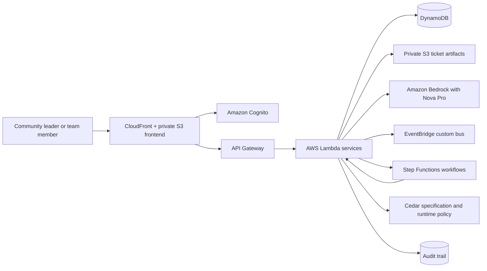

update following README.md as it is:# CommunityOps

## Problem

Community leaders running AWS and other community events continuously coordinate speakers, volunteers and teams, attendees, check-in, incidents, approvals, follow-ups, operational tasks, audit history, and event-day exceptions.

Registration is only one moment in that lifecycle. The harder problem is keeping many moving parts aligned before and during an event.

CommunityOps reduces repetitive coordination work while preserving human control over consequential decisions.

## Solution

CommunityOps acts as an operations layer for community leaders:

**Detects → Understands → Retrieves context → Plans → Checks policy → Acts when authorized → Waits for approval when required → Verifies → Audits → Re-evaluates**

Deterministic systems establish facts. AI reasons about those facts. Policies control authority. Workflows coordinate multi-step processes. Humans approve financial, irreversible, and high-risk actions.

## How It Works

| Layer | Implementation |
|---|---|
| Frontend | React 19, TypeScript, Vite, React Router, and an accessible light design system |
| Authentication | Amazon Cognito user pools and group-derived organization and role context |
| API | Amazon API Gateway |
| Compute | AWS Lambda on Python 3.12 |
| Data | Amazon DynamoDB with organization-scoped keys and global secondary indexes |
| Storage | Private Amazon S3 buckets for ticket artifacts and frontend assets |
| AI | Amazon Bedrock Converse API with Amazon Nova Pro |
| Agent | Framework-neutral typed tool loop; Strands factories consume the shared registry |
| Workflow | AWS Step Functions for speaker follow-up and incident response; Amazon EventBridge custom bus for domain events |
| Policy | Cedar policy specification with a tested Python runtime enforcement layer |
| Hosting | Amazon CloudFront with a private Amazon S3 origin |
| Infrastructure | AWS SAM and AWS CloudFormation |

The deployed Agent sees only role-appropriate typed tools. Tool results establish operational facts, and prompt content cannot widen authorization.

## Core Capabilities

- **Command Center** — answers “Does anything need me right now?” using deterministic health, attention, brief, and activity data.
- **SpeakerOps** — tracks speaker lifecycle, silence, details, and prepared follow-up drafts.
- **TeamOps** — shows real teams, workload, tasks, blockers, and dedicated reassignment flows.
- **AttendeeOps** — summarizes registration readiness and privacy-conscious exception lists.
- **IncidentOps** — provides incident details, discussion, linked tasks, and dedicated resolve and reopen workflows.
- **Check-In** — performs deterministic attendee search, verification, ticket recovery, payment reconciliation, QR verification, and idempotent completion.
- **Approvals** — presents risk, evidence, projections, approve, decline, and edited-action decisions with recorded outcomes.
- **Budget** — displays backend-authoritative totals and supports leader-only totals, allocations, expenses, and projections in whole rupees.
- **Agent** — provides an operational conversation with evidence, role-aware capabilities, and visible approval boundaries.
- **Audit** — shows chronological actor, action, result, resource, and timestamp history without exposing internal reasoning.

## Check-In

The event-day recovery flow is deterministic:

**Search → Verify → Recover → Reconcile → Complete**

Registration, payment, cancellation, refund, and eligibility truth comes from backend records rather than an LLM.

Ticket recovery creates a private PDF with an HMAC-signed QR payload in Amazon S3. Recovery and completion are idempotent, ambiguous matches require a human selection, and unresolved payments create an honest recovery case instead of reporting a false success.

## Human-in-the-Loop

Consequential actions follow this boundary:

**Agent → Policy → Approval → Authorized execution → Verification → Audit**

The interface distinguishes between an action that CommunityOps has performed and one that has only been prepared for approval.

CommunityOps never exposes:

- Chain-of-thought
- Hidden reasoning
- System prompts
- Model internals
- Token usage
- Internal policy implementation

## Security

- Amazon Cognito authentication protects API routes. `/demo/session` is the deliberately restricted exception.
- `LEADER` and `TEAM_MEMBER` roles come from trusted Cognito groups.
- Organization membership and DynamoDB access are tenant-scoped.
- Cross-organization requests fail closed.
- Backend authorization remains authoritative even when the frontend hides unavailable controls.
- Runtime IAM roles are resource-scoped.
- Focused live checks found no `Action: "*"` or `Resource: "*"` in the Agent and Incident workflow policies.
- Ticket objects are private, encrypted, and accessed through short-lived presigned URLs.
- QR payloads use server-side HMAC verification.
- Operational changes produce audit records.
- No passwords, AWS keys, Cognito tokens, or demo credentials are stored in the frontend.

## Impact

The AWS Student Builder Group footprint described in the hackathon brief spans 977+ universities across 63+ countries, illustrating the type of distributed community ecosystem CommunityOps is designed to support.

### Potential Organizational Reach

CommunityOps is designed for distributed university communities, AWS User Groups, and community-event teams that repeatedly coordinate speakers, volunteers, attendees, and event-day operations.

The figures above represent the community footprint described in the hackathon brief. They are not measured CommunityOps adoption.

### Direct Users

- Community leaders
- Event organizers
- Volunteer and team leads
- Speaker coordinators
- Registration and check-in leads

### Indirect Users

- Speakers
- Attendees
- Volunteers
- Sponsors
- Venue and logistics teams

### Actual Impact Metric

The strongest future impact metric is:

**Hours saved per event × Events supported × Organizers using CommunityOps**

The hackathon implementation did not measure production hours saved. Future evaluation should measure actual operational actions and organizer time saved rather than inventing a global user-impact number.

## AWS / Hackathon Track

CommunityOps fits the **Ship It** direction because a working application was deployed and exercised on AWS.

The implementation uses:

- Amazon Cognito
- Amazon API Gateway
- AWS Lambda
- Amazon DynamoDB
- Amazon S3
- Amazon EventBridge
- AWS Step Functions
- Amazon Bedrock
- Amazon CloudFront
- AWS SAM
- AWS CloudFormation

The architecture uses managed and serverless services to minimize server management and target resource usage. Exact cost savings were not measured during the hackathon.

## Learning

This was the first end-to-end Kiro development experience for the project.

Kiro supported:

- Brainstorming and problem exploration
- Architecture finalization
- Implementation
- Debugging
- Test generation
- Refactoring
- Validation
- Deployment assistance

Product and architecture decisions remained with the developer. Kiro accelerated implementation and helped investigate problems, but it did not independently design or approve the entire system.

Official AWS documentation and live service behavior drove revisions to:

- Amazon Cognito handling
- API Gateway CORS behavior
- Bedrock model selection
- Bedrock inference-profile usage
- IAM resource permissions
- Deployment configuration

Steering and hooks helped preserve product identity, security boundaries, naming conventions, and repeatable validation practices. The project also provided practical experience with AWS serverless architecture, Bedrock tool use, Cognito, Step Functions, EventBridge, tenant isolation, and deployment debugging.

## Challenges

The project required reconciling a polished frontend branch with a newer backend without overwriting either source of truth.

Other concrete challenges included:

- Frontend and backend API integration
- Cognito authentication and tenant isolation
- Honest Agent failure-state semantics
- Concurrent incident lifecycle mutations
- API Gateway preflight authorization
- Bedrock inference-profile compatibility
- Legacy Bedrock model availability
- Scoped Agent Lambda permissions
- Marketplace-gated model availability
- Moving to the available AWS-native Amazon Nova Pro model
- Deterministic Check-In recovery
- Deployment identity and permissions boundaries
- Preserving CloudFormation `NoEcho` parameters
- Live AWS verification

The deployed Agent initially used a model configuration that was unavailable in the target account. Live verification exposed the incompatibility, and the runtime was moved to Amazon Nova Pro without changing the Agent’s typed tool architecture.

## Demo

The recommended three-minute narrative is:

**Login → Command Center → Agent → Approval boundary → IncidentOps → Check-In → Audit**

The demo should tell one operational story:

1. Sign in to CommunityOps.
2. Open the Command Center and identify what needs attention.
3. Ask the Agent for a concise operational summary.
4. Show the boundary between automatic work and actions requiring human approval.
5. Open IncidentOps to inspect the incident state and discussion.
6. Demonstrate deterministic Check-In verification and ticket recovery.
7. Finish with the Audit view to show verifiable operational history.

The demo should present CommunityOps as an event operations system, not as a generic chatbot.

## Architecture



## Local Development

### Prerequisites

- Python 3.12 or later
- Node.js 20 or later
- AWS CLI v2
- AWS SAM CLI

### Install Dependencies

```powershell
pip install -e ".[dev]"
npm install --prefix apps/web
```

### Run Backend Tests

```powershell
pytest tests/unit/ -v
```

### Validate the Frontend

```powershell
npm run typecheck --prefix apps/web
npm run lint --prefix apps/web
cmd.exe /d /s /c "npm test --prefix apps/web -- --run"
npm run build --prefix apps/web
```

### Configure the Frontend

Copy:

```text
apps/web/.env.example
```

to:

```text
apps/web/.env.local
```

Provide the deployed stack values for:

```text
VITE_API_URL
VITE_COGNITO_USER_POOL_ID
VITE_COGNITO_CLIENT_ID
```

`VITE_USE_MOCK=true` enables explicit local UI development data. Mock data is never used as a production fallback when an API request fails.

## Deployment

The tracked `samconfig.toml` targets the `CommunityOps` stack in `ap-south-1`.

Validate and deploy using an explicitly selected AWS profile:

```powershell
sam validate --lint --region ap-south-1 --profile <profile>
sam build --region ap-south-1 --profile <profile>
sam deploy --region ap-south-1 --profile <profile>
```

After deploying the backend:

1. Build `apps/web` using the deployed API Gateway and Cognito values.
2. Sync `apps/web/dist` to the web bucket produced by the stack.
3. Invalidate the stack’s CloudFront distribution.

Never place passwords, AWS credentials, Cognito tokens, QR signing keys, or other secrets in committed environment files.

## Current Verification and Limitations

Live AWS verification established:

- CloudFormation stack deployment
- API Gateway routing
- Lambda execution
- DynamoDB tables and indexes
- Private and encrypted S3 ticket artifacts
- Cognito demo authentication
- Tenant isolation
- Browser CORS preflight
- Deterministic Check-In
- QR verification
- Amazon Bedrock Agent conversation using Amazon Nova Pro
- EventBridge custom-bus ingestion
- Step Functions incident workflow reaching its human-approval wait

Current verification limitations:

- Leader-only approval decisions were not live-rehearsed with a leader identity.
- Leader-only Incident resolve and reopen actions were not live-rehearsed.
- EventBridge bus ingestion was verified, but no EventBridge rule currently targets the Step Functions workflows. The incident workflow was exercised directly.

See the [detailed CommunityOps project report](docs/COMMUNITYOPS_PROJECT_REPORT.md) and the existing documents under [`docs/`](docs/).

## Judging Alignment

### 01 Idea & Impact

CommunityOps addresses continuous community operations rather than only event registration. It reduces repetitive coordination while preserving human authority over consequential decisions.

### 02 Built on AWS

The deployed implementation uses Cognito, API Gateway, Lambda, DynamoDB, S3, EventBridge, Step Functions, Bedrock, CloudFront, SAM, and CloudFormation.

### 03 Learning

The project reflects practical learning with Kiro, official AWS documentation, serverless services, identity management, typed agents, policy boundaries, and live deployment debugging.

### 04 Execution

The final system includes complete operational screens, a tested backend, a typed Agent tool loop, deterministic Check-In, approval boundaries, tenant isolation, and live AWS verification.

### 05 Demo

The three-minute narrative demonstrates operational attention, Agent assistance, human approval boundaries, incident management, event-day recovery, and audit evidence.

## License

MIT — see [LICENSE](LICENSE).
