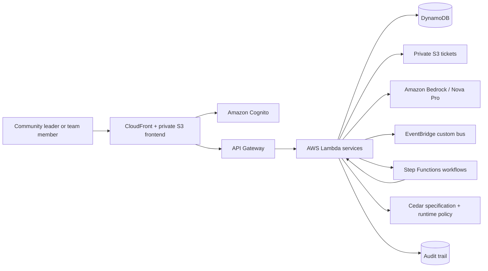

# CommunityOps

## One-Line Description

AI-powered community operations agent that helps community and event leaders coordinate repetitive operational work while keeping consequential decisions with humans.

## Problem

Community leaders running AWS and other community events continuously coordinate speakers, volunteers and teams, attendees, check-in, incidents, approvals, follow-ups, operational tasks, audit history, and event-day exceptions. Registration is only one moment in that lifecycle; the harder problem is keeping many moving parts aligned before and during an event.

CommunityOps reduces repetitive coordination work while preserving human control over consequential decisions.

## Solution

CommunityOps acts as an operations layer for community leaders:

**Detects → Understands → Retrieves context → Plans → Checks policy → Acts when authorized → Waits for approval when required → Verifies → Audits → Re-evaluates**

Deterministic systems establish facts. AI reasons about those facts. Policies control authority. Workflows coordinate multi-step processes. Humans approve financial, irreversible, and high-risk actions.

## How It Works

| Layer | Implementation |
|---|---|
| Frontend | React 19, TypeScript, Vite, React Router, accessible light design system |
| Authentication | Amazon Cognito user pools and group-derived organization/role context |
| API | Amazon API Gateway |
| Compute | AWS Lambda on Python 3.12 |
| Data | Amazon DynamoDB with organization-scoped keys and GSIs |
| Storage | Private Amazon S3 buckets for tickets and frontend assets |
| AI | Amazon Bedrock Converse API with Amazon Nova Pro |
| Agent | Framework-neutral typed tool loop; Strands factories consume the shared registry |
| Workflow | AWS Step Functions for speaker follow-up and incident response; EventBridge custom bus for domain events |
| Policy | Cedar policy specification with a tested Python runtime enforcement layer |
| Hosting | Amazon CloudFront with private S3 origin |
| Infrastructure | AWS SAM and CloudFormation |

The deployed Agent sees only role-appropriate typed tools. Tool results establish operational facts; prompts cannot widen authorization.

## Core Capabilities

- **Command Center** — answers “Does anything need me right now?” using deterministic health, attention, brief, and activity data.
- **SpeakerOps** — tracks speaker lifecycle, silence, details, and prepared follow-up drafts.
- **TeamOps** — shows real teams, workload, tasks, blockers, and dedicated reassignment flows.
- **AttendeeOps** — summarizes registration readiness and privacy-conscious exception lists.
- **IncidentOps** — provides incident detail, discussion, linked tasks, and dedicated resolve/reopen workflows.
- **Check-In** — performs deterministic attendee search, verification, ticket recovery, payment reconciliation, QR verification, and idempotent completion.
- **Approvals** — presents risk, evidence, projections, approve/decline/edit decisions, and recorded outcomes.
- **Budget** — displays backend-authoritative totals and supports leader-only totals, allocations, expenses, and projections in whole rupees.
- **Agent** — provides operational conversation with evidence, role-aware capabilities, and visible approval boundaries.
- **Audit** — shows chronological actor, action, result, resource, and timestamp history without exposing internal reasoning.

## Check-In

The event-day recovery flow is deterministic:

**Search → Verify → Recover → Reconcile → Complete**

Registration, payment, cancellation, refund, and eligibility truth comes from backend records rather than an LLM. Ticket recovery creates a private PDF with an HMAC-signed QR payload in S3. Recovery and completion are idempotent, ambiguous matches require a human selection, and unresolved payments create an honest recovery case instead of a false success.

## Human-in-the-Loop

Consequential actions follow the boundary:

**Agent → Policy → Approval → Authorized execution → Verification → Audit**

The UI distinguishes an action that CommunityOps can perform from one merely prepared for approval. It never exposes chain-of-thought, prompts, model internals, or hidden policy implementation.

## Security

- Cognito authentication on protected API routes; `/demo/session` is the deliberately restricted exception.
- `LEADER` and `TEAM_MEMBER` roles come from trusted Cognito groups.
- Organization membership and DynamoDB access are tenant-scoped; cross-organization requests fail closed.
- Backend authorization remains authoritative even when the UI hides unavailable controls.
- Runtime IAM roles are resource-scoped; focused live checks found no `Action: "*"` or `Resource: "*"` in the Agent and Incident workflow policies.
- Ticket objects are private, encrypted, and accessed through short-lived presigned URLs.
- QR payloads use server-side HMAC verification.
- Operational changes produce audit records.
- No passwords, AWS keys, tokens, or demo credentials are stored in the frontend.

## Impact

The AWS Student Builder Group footprint described in the hackathon brief spans 977+ universities across 63+ countries, illustrating the type of distributed community ecosystem CommunityOps is designed to support.

### Potential organizational reach

University communities across that footprint, plus organizations such as AWS User Groups and community-event teams.

### Direct users

Community leaders, event organizers, volunteer/team leads, speaker coordinators, and registration/check-in leads.

### Indirect users

Speakers, attendees, volunteers, sponsors, and venue/logistics teams.

### Actual impact metric

**Hours saved per event × events supported × organizers using CommunityOps**

The hackathon implementation did not measure production hours saved. Future evaluation should measure real actions and organizer time saved rather than inventing a global user-impact number.

## AWS / Hackathon Track

CommunityOps fits the **Ship It** direction because a working application was deployed and exercised on AWS. It uses managed/serverless services—Cognito, API Gateway, Lambda, DynamoDB, S3, EventBridge, Step Functions, Bedrock, CloudFront, and CloudFormation/SAM—to minimize server management and target resource usage. Exact cost savings were not measured during the hackathon.

## Learning

This was the first end-to-end Kiro development experience for the project. Kiro supported brainstorming, architecture finalization, implementation, debugging, test generation, refactoring, validation, and deployment assistance while decisions remained with the developer. Official AWS documentation and live service behavior drove revisions to Cognito, CORS, Bedrock model selection, IAM resources, and deployment handling.

Steering and hooks helped preserve product identity, security boundaries, naming, and repetitive validation practices. The project also provided practical experience with serverless architecture, Bedrock tool use, Cognito, Step Functions, EventBridge, tenant isolation, and real deployment debugging.

## Challenges

The work required reconciling a polished frontend branch with a newer backend without overwriting either source of truth. Other concrete challenges included Cognito/tenant isolation, honest Agent failure semantics, concurrent incident lifecycle mutations, API Gateway preflight authorization, Bedrock inference-profile and model availability, scoped Agent Lambda permissions, deterministic Check-In recovery, deployment identity permissions, preserving NoEcho stack parameters, and live AWS verification.

The deployed Agent moved from a legacy/Marketplace-gated model configuration to the available AWS-native Amazon Nova Pro model after live verification exposed the incompatibility.

## Demo

Recommended three-minute narrative:

**Login → Command Center → Agent → Approval boundary → IncidentOps → Check-In → Audit**

The demo should tell one operational story: CommunityOps identifies what needs attention, handles bounded work, pauses at a consequential decision, supports an event-day recovery, and leaves verifiable evidence. It is an operations experience, not a generic chatbot demo.

## Architecture



## Local Development

Prerequisites: Python 3.12+, Node.js 20+, AWS CLI v2, and AWS SAM CLI.

```powershell
pip install -e ".[dev]"
npm install --prefix apps/web
pytest tests/unit/ -v
npm run typecheck --prefix apps/web
npm run lint --prefix apps/web
cmd.exe /d /s /c "npm test --prefix apps/web -- --run"
npm run build --prefix apps/web
```

Copy `apps/web/.env.example` to `apps/web/.env.local` and provide stack output values for `VITE_API_URL`, `VITE_COGNITO_USER_POOL_ID`, and `VITE_COGNITO_CLIENT_ID`. `VITE_USE_MOCK=true` is explicit local UI mode and never a production fallback.

## Deployment

The tracked `samconfig.toml` targets stack `CommunityOps` in `ap-south-1`. Validate and deploy using an explicitly selected AWS profile:

```powershell
sam validate --lint --region ap-south-1 --profile <profile>
sam build --region ap-south-1 --profile <profile>
sam deploy --region ap-south-1 --profile <profile>
```

Build `apps/web` with the deployed API/Cognito values, sync `apps/web/dist` to the stack’s web bucket, and invalidate the stack’s CloudFront distribution. Never place credentials in environment files committed to Git.

## Current Verification and Limitations

Live AWS verification established CloudFormation, API Gateway, Lambda, DynamoDB, private/encrypted S3 tickets, Cognito demo authentication, tenant isolation, CORS, Check-In/QR, Amazon Bedrock Agent conversation, EventBridge bus ingestion, and a Step Functions incident workflow reaching its human-approval wait.

- Leader-only approval decision was not live-rehearsed with a leader identity.
- Leader-only Incident resolve/reopen was not live-rehearsed.
- EventBridge bus ingestion was verified, but no EventBridge rule currently targets the Step Functions workflows; the workflow was exercised directly.

See [the detailed project report](docs/COMMUNITYOPS_PROJECT_REPORT.md) and the existing documents under [`docs/`](docs/).

## Judging Alignment

- **01 Idea & Impact** — targets continuous operational coordination while preserving human authority.
- **02 Built on AWS** — deployed across Cognito, API Gateway, Lambda, DynamoDB, S3, EventBridge, Step Functions, Bedrock, CloudFront, SAM, and CloudFormation.
- **03 Learning** — reflects documented iteration with Kiro, AWS documentation, serverless services, identity, agents, and deployment debugging.
- **04 Execution** — complete operational screens and critical AWS paths were locally tested and live exercised.
- **05 Demo** — a focused operational narrative demonstrates attention, bounded Agent action, approval, recovery, and audit evidence.

## License

MIT — see [LICENSE](LICENSE).
